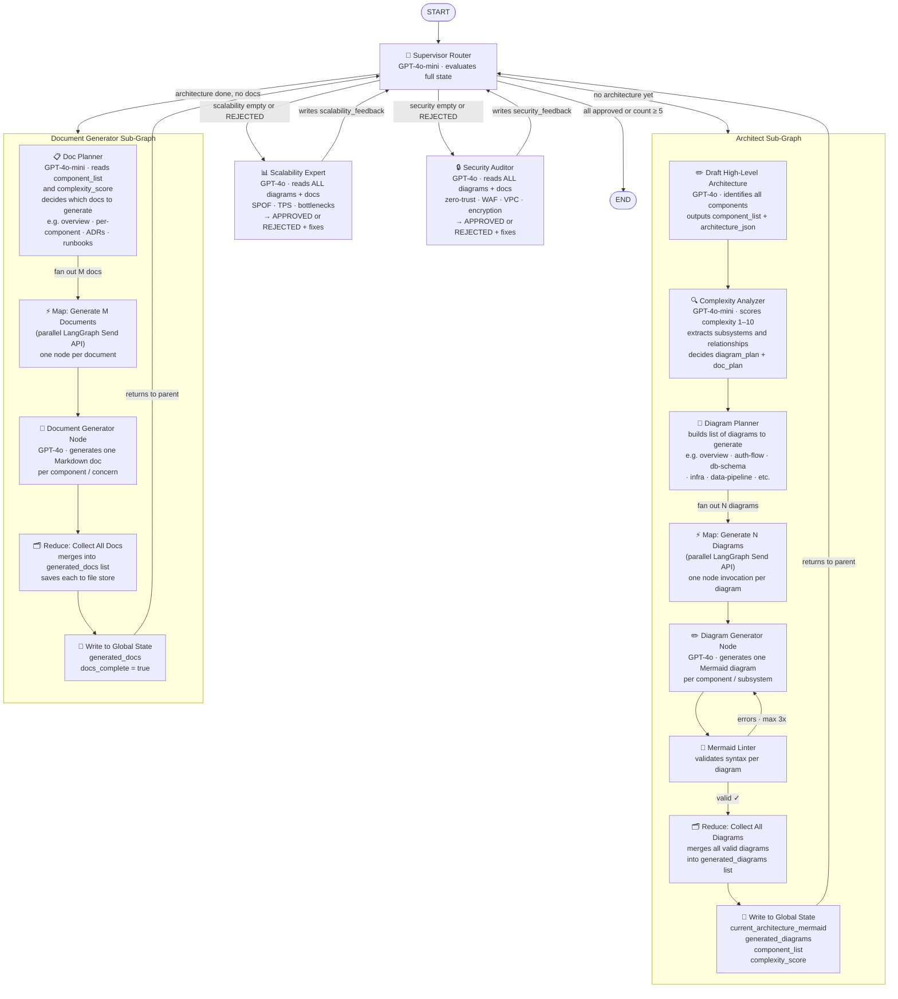

# Autonomous System Architecture Swarm — LangGraph Implementation Guide

> **Purpose**: This document is the single source of truth for implementing the LangGraph multi-agent swarm. It covers graph topology, state design, agent responsibilities, tool contracts, storage strategy, and implementation constraints. A coding agent must read this entire document before writing any code.

---

## Table of Contents

1. [System Overview](#1-system-overview)
2. [Full Graph Diagram](#2-full-graph-diagram)
3. [State Design](#3-state-design)
4. [Graph Topology](#4-graph-topology)
5. [Agent Definitions](#5-agent-definitions)
6. [Sub-Graph Contracts](#6-sub-graph-contracts)
7. [Map-Reduce Pattern](#7-map-reduce-pattern)
8. [Storage Architecture](#8-storage-architecture)
9. [FastAPI Integration](#9-fastapi-integration)
10. [File Structure](#10-file-structure)
11. [Implementation Order](#11-implementation-order)
12. [Critical Constraints](#12-critical-constraints)

---

## 1. System Overview

The swarm simulates a team of senior engineers collaboratively designing cloud infrastructure. A user submits a system design requirement (e.g. "Design a globally distributed URL shortener"). The graph autonomously:

1. Drafts a high-level architecture and analyzes its complexity
2. Generates N Mermaid diagrams (one per subsystem, determined at runtime)
3. Generates M Markdown documentation files (one per component/concern, determined at runtime)
4. Runs a Scalability Expert review and a Security Auditor review
5. Loops until both reviewers APPROVE or the iteration circuit breaker fires

The number of diagrams and documents is **not known at design time** — it is determined dynamically by the Complexity Analyzer node based on the architecture. This requires the **LangGraph Send API (Map-Reduce pattern)** for parallel fan-out.

---

## 2. Full Graph Diagram



---

## 3. State Design

### 3.1 Global Swarm State

Shared across ALL agents via the Supervisor. Lives in `schema.py`. Every field must have a default to avoid initialization errors.

```python
# schema.py
from typing import TypedDict, Annotated
import operator

class DiagramEntry(TypedDict):
    diagram_type: str        # e.g. "overview", "auth-flow", "db-schema"
    content:      str        # raw Mermaid string
    path:         str        # R2/S3 key — e.g. "diagrams/{thread_id}/v2_overview.mmd"
    iteration:    int        # which swarm iteration produced this

class DocEntry(TypedDict):
    title:   str             # e.g. "Auth Service — Component Overview"
    content: str             # raw Markdown string
    path:    str             # R2/S3 key — e.g. "reports/{thread_id}/auth-service.md"

class GlobalSwarmState(TypedDict):
    # ── Core input ──────────────────────────────────────────
    task_requirement:             str           # user prompt, never mutated after init

    # ── Architecture output ──────────────────────────────────
    current_architecture_mermaid: str           # primary overview diagram (Mermaid string)
    architecture_json:            dict          # structured component map for programmatic use

    # ── Complexity analysis ──────────────────────────────────
    component_list:               list[str]     # ["API Gateway", "Auth Service", ...]
    complexity_score:             int           # 1–10; drives how many diagrams/docs are made
    diagram_plan:                 list[str]     # ["overview", "auth-flow", "db-schema", ...]
    doc_plan:                     list[str]     # ["overview.md", "auth-service.md", ...]

    # ── Generated artifacts ──────────────────────────────────
    # Annotated with operator.add so parallel Send() nodes can append safely
    generated_diagrams:           Annotated[list[DiagramEntry], operator.add]
    generated_docs:               Annotated[list[DocEntry], operator.add]

    # ── Review feedback ──────────────────────────────────────
    scalability_feedback:         str           # Markdown critique OR "APPROVED"
    security_feedback:            str           # Markdown critique OR "APPROVED"

    # ── Control flow ─────────────────────────────────────────
    iteration_count:              int           # incremented by Supervisor; hard limit = 5
    docs_complete:                bool          # set True by Doc sub-graph on completion
    next_agent:                   str           # routing flag set by Supervisor
```

> **Critical**: `generated_diagrams` and `generated_docs` use `Annotated[list, operator.add]`. This is mandatory for the Map-Reduce pattern — without it, parallel `Send()` invocations will overwrite each other instead of merging results.

### 3.2 Architect Internal State

Local to the Architect sub-graph only. Never surfaces to global state.

```python
class ArchitectInternalState(TypedDict):
    draft_mermaid:       str        # scratchpad before linting
    linter_errors:       list[str]  # feedback from mermaid_linter tool
    internal_loop_count: int        # prevents infinite lint-fix cycles; hard limit = 3
    current_diagram_type: str       # which diagram is being generated in this invocation
```

### 3.3 Diagram Generator State (Map-Reduce worker)

Each parallel `Send()` invocation gets its own isolated copy of this state.

```python
class DiagramWorkerState(TypedDict):
    diagram_type:        str        # which diagram to generate e.g. "auth-flow"
    task_requirement:    str        # passed down from global state
    architecture_json:   dict       # passed down so worker has full context
    draft_mermaid:       str        # scratchpad
    linter_errors:       list[str]
    internal_loop_count: int        # limit = 3
    thread_id:           str        # needed for file store path
    iteration:           int        # current swarm iteration
```

---

## 4. Graph Topology

### 4.1 Parent Graph — Supervisor

File: `supervisor_graph.py`

The parent graph is a **cyclic StateGraph**. Every worker (sub-graph or plain node) always returns to the Supervisor after completing. The Supervisor never generates content — it only reads state and sets `next_agent`.

```
Nodes:
  - supervisor_node       (plain node)
  - architect_graph       (compiled sub-graph, added as single node)
  - doc_generator_graph   (compiled sub-graph, added as single node)
  - scalability_node      (plain node)
  - security_node         (plain node)

Edges:
  START → supervisor_node
  supervisor_node → [conditional edge] → architect_graph
                                       | doc_generator_graph
                                       | scalability_node
                                       | security_node
                                       | END
  architect_graph      → supervisor_node
  doc_generator_graph  → supervisor_node
  scalability_node     → supervisor_node
  security_node        → supervisor_node
```

### 4.2 Routing Logic (Supervisor)

Evaluated strictly in this priority order:

```python
def supervisor_route(state: GlobalSwarmState) -> str:
    if state["iteration_count"] >= 5:
        return "END"
    if not state.get("current_architecture_mermaid"):
        return "architect_graph"
    if not state.get("docs_complete"):
        return "doc_generator_graph"
    if not state.get("scalability_feedback") or "REJECTED" in state["scalability_feedback"]:
        return "scalability_node"
    if not state.get("security_feedback") or "REJECTED" in state["security_feedback"]:
        return "security_node"
    if state["scalability_feedback"] == "APPROVED" and state["security_feedback"] == "APPROVED":
        return "END"
    return "END"  # fallback
```

### 4.3 Architect Sub-Graph

File: `architect_graph.py`

Internal topology (sequential then fan-out):

```
draft_node → complexity_analyzer_node → diagram_planner_node
           → [Send API fan-out] → diagram_generator_node (×N, parallel)
                                → linter_node (×N, parallel)
                                → [conditional: errors → diagram_generator_node]
                                → [valid → reduce passthrough]
           → reduce_node → write_state_node → END
```

This sub-graph is compiled independently and then registered as a single node in the parent graph. The parent graph has no visibility into its internal loop.

### 4.4 Document Generator Sub-Graph

File: `doc_generator_graph.py`

```
doc_planner_node → [Send API fan-out] → doc_generator_node (×M, parallel)
                → reduce_node → write_docs_node → END
```

Documents do not require linting. Each doc generator node calls the file store to persist the Markdown immediately before returning to the reduce node.

---

## 5. Agent Definitions

### 5.1 Supervisor Router

| Property | Value |
|---|---|
| Model | `gpt-4o-mini` |
| Tools | None |
| Output | Sets `next_agent` in state (Enum: architect, docs, scalability, security, END) |
| Increments | `iteration_count` on every invocation |
| Responsibility | Pure routing — reads state, never generates content |

System prompt must instruct the model to evaluate routing rules strictly in priority order and output ONLY a structured enum value.

### 5.2 Lead Architect (Draft Node)

| Property | Value |
|---|---|
| Model | `gpt-4o` |
| Tools | `cloud_docs_search` (optional Tavily) |
| Output | `architecture_json`, high-level description, initial `component_list` |
| Writes to | `ArchitectInternalState` only — never writes directly to `GlobalSwarmState` |

Prompt mandate: identify all components, define their relationships, estimate traffic patterns. Output must be valid JSON matching `architecture_json` schema.

### 5.3 Complexity Analyzer

| Property | Value |
|---|---|
| Model | `gpt-4o-mini` |
| Tools | None |
| Input | `architecture_json`, `component_list` |
| Output | `complexity_score` (1–10), finalized `diagram_plan`, `doc_plan` |

Scoring guide the model must follow:

- Score 1–3: monolith or simple 2-tier. Produces: 1 diagram (overview), 1 doc (overview).
- Score 4–6: microservices with 3–6 components. Produces: 3–4 diagrams, 3–5 docs.
- Score 7–10: distributed systems with 7+ components. Produces: 5–10 diagrams, 6–12 docs.

`diagram_plan` values must be from a controlled vocabulary: `overview`, `auth-flow`, `db-schema`, `infra`, `data-pipeline`, `api-contracts`, `event-flow`, `deployment`.

`doc_plan` values must be slugified filenames: `overview.md`, `{component-name}.md`, `adr-{title}.md`, `runbook-{title}.md`.

### 5.4 Diagram Generator Node

| Property | Value |
|---|---|
| Model | `gpt-4o` |
| Tools | `mermaid_linter` (Python tool) |
| Input | `DiagramWorkerState` (one per parallel invocation) |
| Output | One valid `DiagramEntry` appended to `generated_diagrams` |
| Max lint loops | 3 per diagram |

Each invocation generates exactly one diagram. The linter validates syntax. On failure, the model receives the specific parse error and must fix it. After 3 failed attempts, the node marks the diagram as `syntax_error` and continues — it must not block the reduce phase.

### 5.5 Document Generator Node

| Property | Value |
|---|---|
| Model | `gpt-4o` |
| Tools | None |
| Input | One `doc_plan` entry + full `architecture_json` + all `generated_diagrams` |
| Output | One `DocEntry` appended to `generated_docs`, file persisted to file store |

Each document must reference relevant Mermaid diagrams by name. Documents are Markdown only — no HTML.

### 5.6 Scalability Expert

| Property | Value |
|---|---|
| Model | `gpt-4o` |
| Tools | None |
| Input | ALL `generated_diagrams`, ALL `generated_docs`, `architecture_json` |
| Output | Writes `scalability_feedback` to global state |
| Output format | Markdown critique ending with `STATUS: APPROVED` or `STATUS: REJECTED` |

Prompt mandate: play devil's advocate. Must evaluate TPS estimations, identify single points of failure, flag missing caching layers, check database connection pool limits. Must be adversarial by design.

### 5.7 Security Auditor

| Property | Value |
|---|---|
| Model | `gpt-4o` |
| Tools | None |
| Input | ALL `generated_diagrams`, ALL `generated_docs`, `architecture_json` |
| Output | Writes `security_feedback` to global state |
| Output format | Markdown critique ending with `STATUS: APPROVED` or `STATUS: REJECTED` |

Prompt mandate: assume the system is under active attack. Flag missing WAFs, exposed databases, absent rate limiting, unencrypted transit/rest, VPC misconfigurations. Must be adversarial by design.

---

## 6. Sub-Graph Contracts

Sub-graphs are compiled independently and registered as single nodes in the parent graph. This isolation is intentional — the parent graph sees only the input and output state boundary, not the internal loop.

### Registering a sub-graph in the parent

```python
# supervisor_graph.py
from architect_graph import architect_graph       # already compiled StateGraph
from doc_generator_graph import doc_graph         # already compiled StateGraph

parent = StateGraph(GlobalSwarmState)
parent.add_node("architect_graph", architect_graph)      # compiled graph as node
parent.add_node("doc_generator_graph", doc_graph)
parent.add_node("scalability_node", scalability_node_fn)
parent.add_node("security_node", security_node_fn)
parent.add_node("supervisor_node", supervisor_node_fn)
```

### State handoff contract

When a sub-graph completes, it returns a **partial state update** — only the fields it owns. It must never reset fields it did not set.

| Sub-graph | Fields it writes to GlobalSwarmState |
|---|---|
| Architect | `current_architecture_mermaid`, `architecture_json`, `component_list`, `complexity_score`, `diagram_plan`, `doc_plan`, `generated_diagrams` |
| Doc Generator | `generated_docs`, `doc_plan` (finalized), `docs_complete` |
| Scalability | `scalability_feedback` |
| Security | `security_feedback` |
| Supervisor | `iteration_count`, `next_agent` |

---

## 7. Map-Reduce Pattern

This is the most critical implementation detail. The number of diagram/doc workers is not known until runtime. LangGraph's `Send` API handles this.

### Fan-out (Map phase)

```python
# Inside diagram_planner_node — returns a list of Send objects
from langgraph.types import Send

def diagram_planner_node(state: GlobalSwarmState) -> list[Send]:
    return [
        Send(
            "diagram_generator_node",
            DiagramWorkerState(
                diagram_type=diagram_type,
                task_requirement=state["task_requirement"],
                architecture_json=state["architecture_json"],
                draft_mermaid="",
                linter_errors=[],
                internal_loop_count=0,
                thread_id=state.get("thread_id", ""),
                iteration=state["iteration_count"],
            )
        )
        for diagram_type in state["diagram_plan"]
    ]
```

### Fan-in (Reduce phase)

The reduce node receives a list of all completed worker outputs. Because `generated_diagrams` is annotated with `operator.add`, LangGraph automatically merges all parallel outputs into a single list.

```python
# The reduce node just validates the merge happened correctly
def reduce_diagrams_node(state: GlobalSwarmState) -> dict:
    valid = [d for d in state["generated_diagrams"] if d["content"] != "syntax_error"]
    failed = [d for d in state["generated_diagrams"] if d["content"] == "syntax_error"]
    # Log failed diagrams for LangSmith tracing
    return {"generated_diagrams": valid}  # overwrite with cleaned list
```

> **Warning**: Do NOT use a plain `list` type for fields that receive parallel `Send()` writes. Without `Annotated[list, operator.add]`, each parallel node will overwrite the list and only the last result will survive.

---

## 8. Storage Architecture

### 8.1 Database separation

Two separate database access layers coexist in the same Postgres instance. They must never be mixed.

| Layer | Tables | Access method | Schema |
|---|---|---|---|
| Application data | `sessions`, `debate_logs`, `users` | SQLAlchemy async | `public` |
| LangGraph checkpoints | `checkpoints`, `checkpoint_blobs`, `checkpoint_writes` | asyncpg (LangGraph-managed) | `langgraph` |
| LangGraph memory store | `store` | asyncpg (LangGraph-managed) | `langgraph` |

### 8.2 Alembic configuration

Alembic must be configured to **exclude the `langgraph` schema entirely**. Add this to `alembic/env.py`:

```python
def include_object(object, name, type_, reflected, compare_to):
    if hasattr(object, "schema") and object.schema == "langgraph":
        return False
    return True

context.configure(
    target_metadata=Base.metadata,
    include_object=include_object,
    include_schemas=False,
)
```

Never run `alembic revision --autogenerate` without this filter — it will attempt to manage LangGraph's tables and create conflicts.

### 8.3 Application models (SQLAlchemy)

```python
# models.py
class Session(Base):
    __tablename__ = "sessions"
    thread_id      = Column(UUID(as_uuid=True), primary_key=True, default=uuid4)
    user_id        = Column(UUID(as_uuid=True), ForeignKey("users.id"), nullable=True)
    requirement    = Column(Text, nullable=False)
    status         = Column(String(20), default="running")   # running | done | failed
    complexity     = Column(Integer, nullable=True)
    diagram_count  = Column(Integer, nullable=True)
    doc_count      = Column(Integer, nullable=True)
    report_path    = Column(String, nullable=True)           # R2/S3 key for final report
    created_at     = Column(DateTime(timezone=True), server_default=func.now())
    completed_at   = Column(DateTime(timezone=True), nullable=True)

class DebateLog(Base):
    __tablename__ = "debate_logs"
    id         = Column(UUID(as_uuid=True), primary_key=True, default=uuid4)
    thread_id  = Column(UUID(as_uuid=True), ForeignKey("sessions.thread_id"))
    agent      = Column(String(30))   # scalability | security
    feedback   = Column(Text)
    status     = Column(String(10))   # APPROVED | REJECTED
    iteration  = Column(Integer)
    created_at = Column(DateTime(timezone=True), server_default=func.now())
```

### 8.4 LangGraph checkpointer setup

```python
# db/checkpointer.py
import asyncpg
from langgraph.checkpoint.postgres.aio import AsyncPostgresSaver

_checkpointer = None

async def get_checkpointer() -> AsyncPostgresSaver:
    global _checkpointer
    if _checkpointer is None:
        conn = await asyncpg.connect(settings.DATABASE_URL)
        _checkpointer = AsyncPostgresSaver(conn, schema="langgraph")
        await _checkpointer.setup()    # idempotent — safe to call every startup
    return _checkpointer
```

### 8.5 File store

For dev: write to local disk. For prod: Cloudflare R2 or AWS S3.

```python
# storage/file_store.py

# Key conventions — must be consistent across all nodes
DIAGRAM_KEY = "diagrams/{thread_id}/iter{iteration}_{diagram_type}.mmd"
DOC_KEY     = "reports/{thread_id}/{filename}"
REPORT_KEY  = "reports/{thread_id}/final_report.md"
```

File content (Mermaid strings and Markdown) is also kept in `GlobalSwarmState` for the duration of the session so agents can read it without fetching from the file store. The file store is the persistent record; state is the working copy.

### 8.6 What lives where

| Data | Lives in | Reason |
|---|---|---|
| Mermaid string (current session) | `GlobalSwarmState.generated_diagrams[].content` | Agents read from state directly |
| Mermaid file (persistent) | File store (R2/S3) | Long-term download / frontend rendering |
| Markdown doc (current session) | `GlobalSwarmState.generated_docs[].content` | Agents read from state directly |
| Markdown file (persistent) | File store (R2/S3) | Long-term storage |
| Agent state + messages | LangGraph checkpointer (Postgres `langgraph` schema) | Automatic — never manage manually |
| Session metadata | `sessions` table (`public` schema) | Application-level tracking |
| Debate logs | `debate_logs` table (`public` schema) | Per-review audit trail |

---

## 9. FastAPI Integration

### 9.1 App startup

```python
# main.py
@asynccontextmanager
async def lifespan(app: FastAPI):
    # 1. Run Alembic migrations programmatically
    alembic_cfg = Config("alembic.ini")
    command.upgrade(alembic_cfg, "head")

    # 2. LangGraph checkpointer (asyncpg, langgraph schema)
    app.state.checkpointer = await get_checkpointer()

    # 3. File store
    app.state.file_store = FileStore()

    # 4. Compile parent graph with checkpointer
    app.state.graph = build_swarm_graph().compile(
        checkpointer=app.state.checkpointer
    )

    yield
```

### 9.2 API endpoints

**POST /api/swarm/start**

Creates a session and starts the graph. Returns `thread_id` immediately. Graph runs async in background.

```python
@router.post("/api/swarm/start")
async def start_swarm(body: StartRequest, db: AsyncSession = Depends(get_db)):
    thread_id = str(uuid4())

    # Save to sessions table
    await db.execute(insert(Session).values(
        thread_id=thread_id,
        requirement=body.requirement,
        status="running"
    ))
    await db.commit()

    # Kick off graph async — do NOT await here
    asyncio.create_task(
        request.app.state.graph.ainvoke(
            {"task_requirement": body.requirement, "iteration_count": 0, "docs_complete": False},
            config={"configurable": {"thread_id": thread_id}}
        )
    )

    return {"thread_id": thread_id}
```

**GET /api/swarm/stream/{thread_id}**

SSE endpoint streaming node-level state diffs as the graph executes.

```python
@router.get("/api/swarm/stream/{thread_id}")
async def stream_swarm(thread_id: str):
    from sse_starlette.sse import EventSourceResponse

    async def generator():
        config = {"configurable": {"thread_id": thread_id}}
        async for event in request.app.state.graph.astream_events(
            None,             # input=None means resume existing thread
            config=config,
            version="v2"
        ):
            if event["event"] == "on_chain_end":
                yield {
                    "data": json.dumps({
                        "node": event["name"],
                        "state_diff": event["data"].get("output", {})
                    })
                }

    return EventSourceResponse(generator())
```

**POST /api/swarm/human-feedback**

Injects user feedback into a paused graph (Human-in-the-Loop).

```python
@router.post("/api/swarm/human-feedback")
async def inject_feedback(body: FeedbackRequest):
    config = {"configurable": {"thread_id": body.thread_id}}
    await request.app.state.graph.aupdate_state(
        config,
        {"task_requirement": body.feedback},   # inject as additional constraint
        as_node="supervisor_node"
    )
    # Resume graph from checkpoint
    asyncio.create_task(
        request.app.state.graph.ainvoke(None, config=config)
    )
    return {"status": "resumed"}
```

---

## 10. File Structure

```
swarm/
├── main.py                          # FastAPI app, lifespan, router registration
├── settings.py                      # Pydantic settings (env vars)
│
├── graph/
│   ├── schema.py                    # GlobalSwarmState, ArchitectInternalState, DiagramWorkerState, DocEntry, DiagramEntry
│   ├── supervisor_graph.py          # Parent StateGraph — compiles all sub-graphs + nodes
│   ├── architect_graph.py           # Architect sub-graph — draft → complexity → fan-out → reduce
│   ├── doc_generator_graph.py       # Doc sub-graph — plan → fan-out → reduce
│   └── reviewer_agents.py           # scalability_node, security_node (plain node functions)
│
├── tools/
│   ├── mermaid_linter.py            # Python tool — validates Mermaid syntax, returns parse errors
│   └── cloud_docs_search.py         # Optional Tavily search tool for AWS/GCP docs
│
├── db/
│   ├── engine.py                    # SQLAlchemy async engine + session factory
│   ├── models.py                    # Session, DebateLog, User models
│   ├── checkpointer.py              # LangGraph AsyncPostgresSaver setup
│   └── deps.py                      # FastAPI dependency: get_db()
│
├── storage/
│   └── file_store.py                # FileStore class — save/fetch Mermaid + Markdown files
│
├── api/
│   └── routes.py                    # /start, /stream/{thread_id}, /human-feedback
│
└── alembic/
    ├── env.py                       # Must exclude langgraph schema
    └── versions/
        └── 001_initial.py           # sessions + debate_logs tables
```

---

## 11. Implementation Order

Implement in this exact order to allow incremental testing at each phase.

**Phase 1 — Foundation**

1. `schema.py` — all TypedDicts with correct `Annotated` fields
2. `tools/mermaid_linter.py` — standalone Python function, test independently
3. `db/models.py` + Alembic migration — sessions + debate_logs tables
4. `db/checkpointer.py` — verify LangGraph creates its tables in `langgraph` schema

**Phase 2 — Architect sub-graph**

5. `architect_graph.py` — build and compile in isolation
6. Test with a simple prompt: verify draft → complexity → diagram_plan → fan-out → reduce → write_state works end-to-end
7. Verify `generated_diagrams` list accumulates correctly from parallel Send() workers

**Phase 3 — Doc sub-graph**

8. `doc_generator_graph.py` — same fan-out pattern as Architect
9. Test: verify M docs are generated and written to file store

**Phase 4 — Reviewer nodes**

10. `reviewer_agents.py` — scalability_node and security_node as plain async functions
11. Test both nodes return a string ending in `STATUS: APPROVED` or `STATUS: REJECTED`

**Phase 5 — Parent graph**

12. `supervisor_graph.py` — wire all sub-graphs + nodes with routing logic
13. Compile with checkpointer
14. Run full end-to-end test with LangSmith tracing enabled

**Phase 6 — FastAPI layer**

15. `api/routes.py` — /start, /stream, /human-feedback
16. Test SSE stream against a running graph

---

## 12. Critical Constraints

**State management**
- `Annotated[list, operator.add]` is mandatory on `generated_diagrams` and `generated_docs`. Without it parallel Send() workers overwrite each other.
- Sub-graphs write only their own fields. They must never reset fields owned by other agents.
- `iteration_count` is incremented only by the Supervisor, never by workers.

**LangGraph vs SQLAlchemy**
- Never pass a SQLAlchemy session into a LangGraph node. They use different async contexts.
- Alembic must never manage the `langgraph` schema. Configure `include_object` filter.
- Call `await checkpointer.setup()` at startup. It is idempotent — safe to call every time.

**Mermaid linter**
- Must return the specific parse error string, not just a boolean. The Diagram Generator node uses the error text in its fix prompt.
- The linter loop hard limit is 3 per diagram. On the 4th failure, mark `content = "syntax_error"` and return — never block the reduce phase.

**Map-Reduce**
- `diagram_planner_node` must return a `list[Send]`, not a state update dict. This is what triggers the fan-out.
- The reduce node runs after ALL parallel workers complete. LangGraph handles this synchronization automatically.

**File store**
- Always write file content to state AND to the file store. State is the working copy for agents; file store is the persistent record for the frontend and downloads.
- Key format must be consistent: `diagrams/{thread_id}/iter{n}_{type}.mmd` and `reports/{thread_id}/{slug}.md`.

**LangSmith**
- Set `LANGCHAIN_TRACING_V2=true` and `LANGCHAIN_API_KEY` in `.env` before running any graph.
- Every node execution, state mutation, and tool call will be visible in LangSmith. Use this to debug hallucinations and routing errors.

**Circuit breaker**
- `iteration_count >= 5` always routes to END regardless of review status. This prevents infinite billing loops when reviewers deadlock.