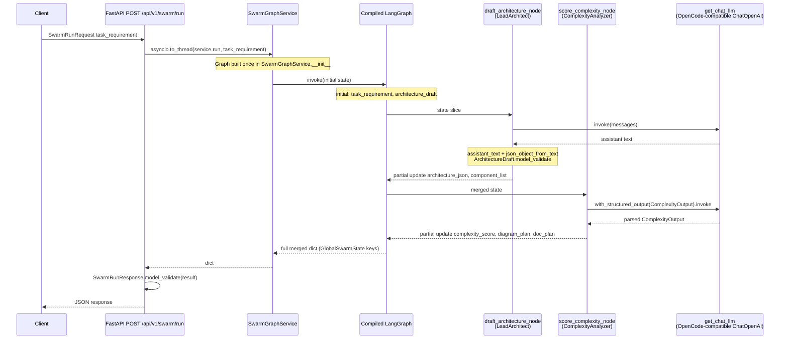
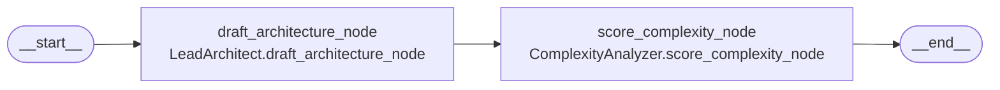
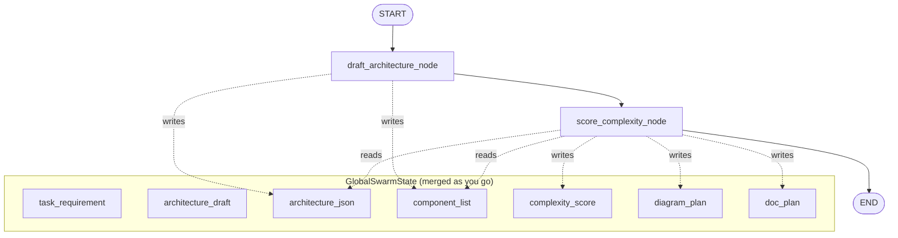

Here are two Mermaid views that match your code today (`app/api/v1/endpoints/swarm.py`, `app/services/swarm_graph_service.py`, `app/agent/run.py`, `GlobalSwarmState`).

---

### 1. End-to-end flow (request → graph → response)

---

### 2. LangGraph structure (nodes and edges only)

This mirrors `GraphBuilder.build_graph()` in `app/agent/run.py`: a single linear graph, no branches.

If you prefer the “state box” style (what each step reads/writes at a high level):

`architecture_draft` is still on the TypedDict but the current nodes do not populate it in the snippets you have; the HTTP layer still returns it via `SwarmRunResponse`.

---

If you want these saved as `.md` in the repo or tweaked (e.g. only sequence, only graph), say what you prefer—Ask mode here, so I can’t write files unless you switch to Agent mode.