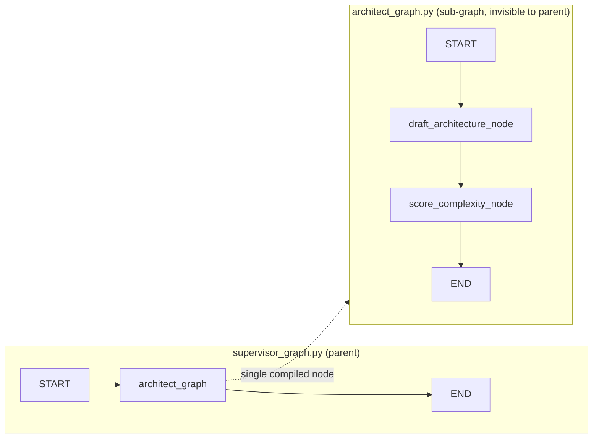
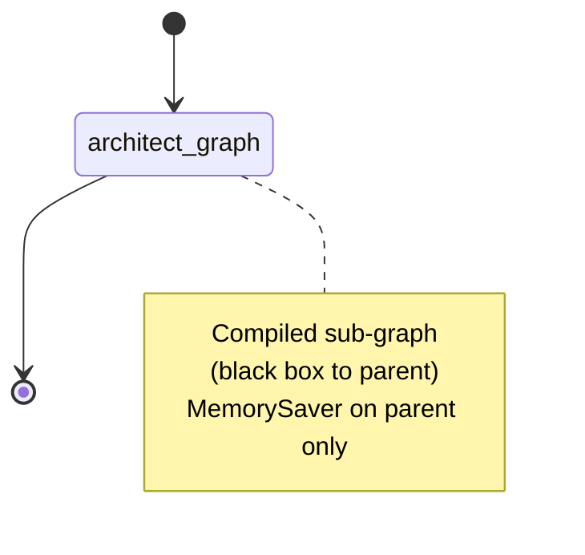
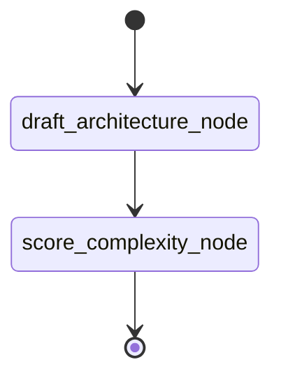
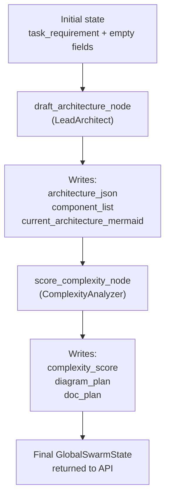
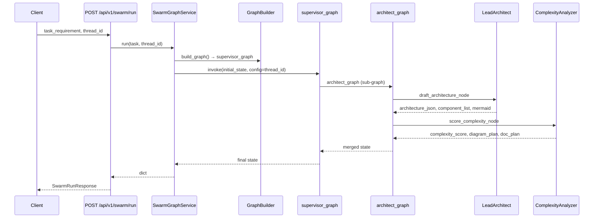
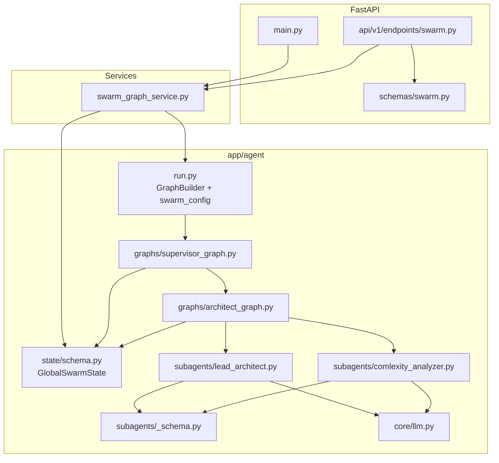
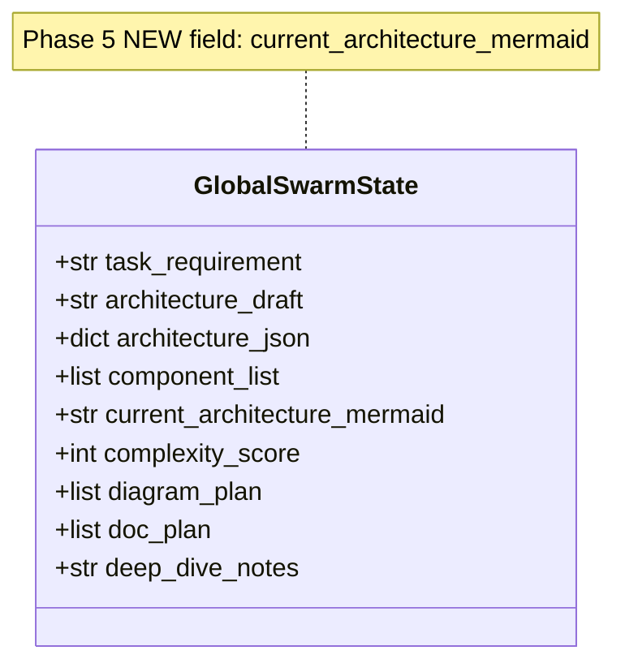
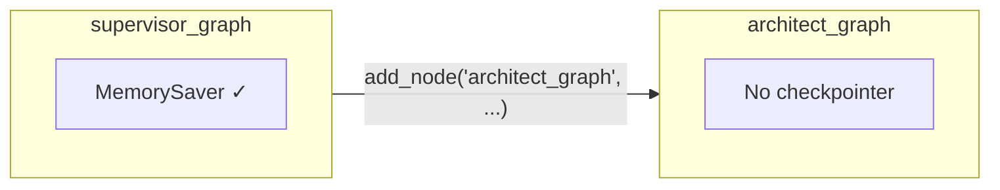
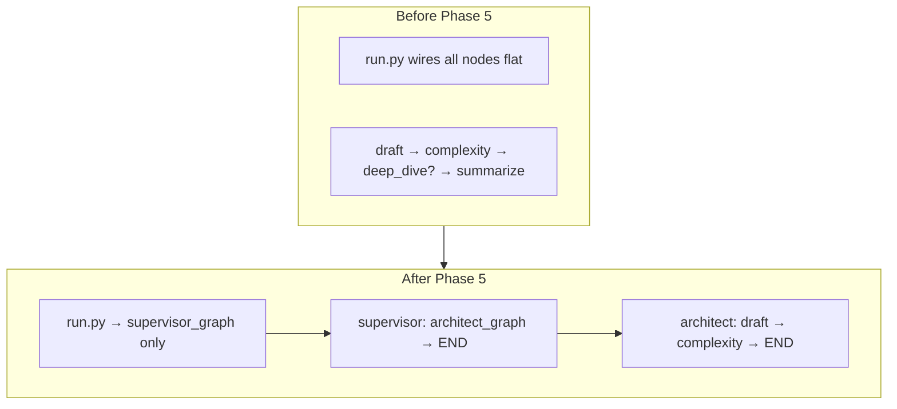

# Phase 5 Report: Sub-graphs

Phase 5’s goal was **sub-graphs**: move architect nodes out of a flat graph into a compiled child `StateGraph`, register it as one opaque node on the parent, and keep the FastAPI stack unchanged.

---

## 1. Conceptual change

**Before Phase 5** — one flat graph in `run.py`:

```
START → draft_architecture_node → score_complexity_node → [conditional] → deep_dive → summarize → END
```

**After Phase 5** — parent + child:



The parent only knows `"architect_graph"`. It does not reference `draft_architecture_node` or `score_complexity_node`.

---

## 2. What we built

### Graph layer

| File | Role |
|------|------|
| `app/agent/graphs/architect_graph.py` | `ArchitectGraph` — sub-graph: draft → complexity; compiled **without** checkpointer |
| `app/agent/graphs/supervisor_graph.py` | `SupervisorGraph` — parent: `START → architect_graph → END`; **`MemorySaver`** on parent only |
| `app/agent/graphs/__init__.py` | Empty package marker |
| `app/agent/run.py` | `GraphBuilder.build_graph()` returns `supervisor_graph`; `swarm_config(thread_id)` for checkpoints |

### Subagents & schemas

| File | Change |
|------|--------|
| `app/agent/subagents/lead_architect.py` | Structured `ArchitectureOutput`; writes `architecture_json`, `component_list`, **`current_architecture_mermaid`** |
| `app/agent/subagents/_schema.py` | `ArchitectureOutput`, `ComponentDetail` (fix for LLM shape) |
| `app/agent/subagents/comlexity_analyzer.py` | Unchanged — reads architecture, writes score + plans |
| `app/agent/state/schema.py` | Added **`current_architecture_mermaid`** to `GlobalSwarmState` |

### FastAPI (unchanged shape, updated fields)

| File | Role |
|------|------|
| `app/services/swarm_graph_service.py` | `GraphBuilder` + initial state + `invoke` / `resume` / `get_checkpoint` |
| `app/schemas/swarm.py` | `SwarmRunResponse` includes `current_architecture_mermaid`, `deep_dive_notes` |
| `app/api/v1/endpoints/swarm.py` | `POST /run`, `POST /resume`, `GET /state/{thread_id}` |

### Bug fix (post-implementation)

Validation failed because the model returns `architecture_json` as `{ "key": { description, relations } }` without `name` inside each value. We added **`ComponentDetail`** (no `name` field) instead of `ArchitectComponent` for dict values.

---

## 3. What Phase 5 deliberately excluded

- No `deep_dive_node` / `summarize_node` in the graph (Phase 3 learning nodes removed from topology for now)
- No conditional supervisor routing (Phase 9)
- No `ArchitectInternalState` split — **Option A**: shared `GlobalSwarmState` in parent and child
- No separate Mermaid generation pipeline (Phase 7) — overview Mermaid comes from **lead architect** at draft time
- No CLI in `run.py` — FastAPI is the entry point

`deep_dive.py`, `summarize.py`, and `supervisor_router.py` still exist on disk but are **not wired** in the Phase 5 graph.

---

## 4. Full implementation topology

### 4.1 LangGraph — parent graph



### 4.2 LangGraph — architect sub-graph



### 4.3 State written per node



### 4.4 FastAPI request flow



### 4.5 Module / file dependency map



---

## 5. `GlobalSwarmState` after Phase 5



**Initial state** (from `SwarmGraphService._empty_swarm_state`):

- `task_requirement` — from API body  
- Everything else empty/zero defaults  

**After a successful run**, the API response includes populated `architecture_json`, `component_list`, `current_architecture_mermaid`, `complexity_score`, `diagram_plan`, `doc_plan`.

---

## 6. Checkpointer design



- Parent owns persistence (`thread_id` via `swarm_config`).
- Child is compiled once at import (`architect_graph = ArchitectGraph().build()`).
- Parent imports that object and treats it as a single node.

---

## 7. API surface (unchanged routes)

| Method | Path | Purpose |
|--------|------|---------|
| `POST` | `/api/v1/swarm/run` | New run with `task_requirement` + `thread_id` |
| `POST` | `/api/v1/swarm/resume` | Resume checkpoint for `thread_id` |
| `GET` | `/api/v1/swarm/state/{thread_id}` | Inspect checkpoint (`next`, `values`) |

---

## 8. Verification checklist (Phase 5 goals)

| # | Goal | Status |
|---|------|--------|
| 1 | `run.py` does not wire draft/complexity nodes inline | Done — only returns `supervisor_graph` |
| 2 | Parent never names inner nodes | Done — only `"architect_graph"` |
| 3 | `current_architecture_mermaid` populated | Done — from `LeadArchitect` |
| 4 | Sub-graph runs inside parent black box | Done — nested invoke in LangGraph |
| 5 | FastAPI path preserved | Done — `SwarmGraphService` unchanged in role |

---

## 9. Before → after (single diagram)



---

## 10. What comes next (not Phase 5)

- **Phase 7** — dedicated Mermaid generation / lint loop (`ArchitectInternalState`)
- **Phase 9** — supervisor conditional routing to more sub-graphs
- **Phase 12** — streaming, human-in-the-loop, Postgres checkpointer

---

If you want this saved as `phase-5-report.md` in the repo or want diagrams for a specific request/response example (e.g. your social media automation prompt), switch to Agent mode and say where to put it.