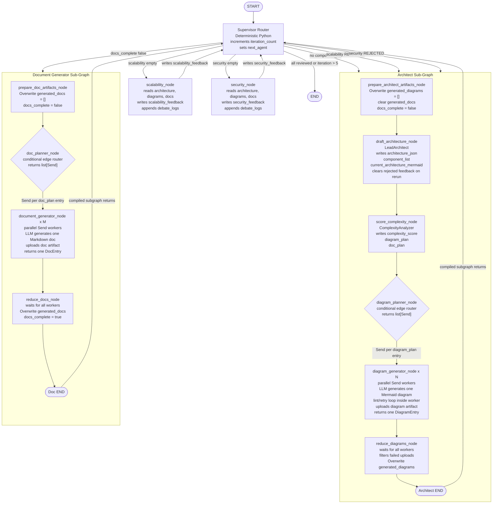

# Autonomous System Architecture Swarm — LangGraph Implementation Guide

> **Purpose**: Target architecture and implementation guide for the LangGraph multi-agent swarm.
>
> **Live behavior:** This is a **roadmap / target design**, not guaranteed to match every line of code. For what runs today, read first:
> - [current/how-the-swarm-graph-works.md](../current/how-the-swarm-graph-works.md)
> - [flows/state-merge-and-artifacts.md](../flows/state-merge-and-artifacts.md)
> - [current/project-state.md](../current/project-state.md)
>
> **State merge (implemented 2026-05-30):** Reducers for `generated_diagrams` / `generated_docs` belong on **subgraph** state (`ArchitectGraphState`, `DocGraphState`), not on parent `GlobalSwarmState`. See [changes/2026-05-30-subgraph-artifact-merge-fix.md](../changes/2026-05-30-subgraph-artifact-merge-fix.md).
>
> Before changing runtime code, compare with: `app/main.py`, `app/services/swarm_graph_service.py`, `app/agent/graphs/`, `app/agent/state/schema.py`.

---

## Table of Contents

1. [System Overview](#1-system-overview)
2. [Full Graph Diagram](#2-full-graph-diagram)
3. [State Design](#3-state-design)
4. [Graph Topology](#4-graph-topology)
5. [Agent Definitions](#5-agent-definitions)
6. [Sub-Graph Contracts](#6-sub-graph-contracts)
7. [Map-Reduce Pattern](#7-map-reduce-pattern)
8. [Storage Architecture](#8-storage-architecture)
9. [FastAPI Integration](#9-fastapi-integration)
10. [File Structure](#10-file-structure)
11. [Implementation Order](#11-implementation-order)
12. [Critical Constraints](#12-critical-constraints)

---

## 1. System Overview

The swarm simulates a team of senior engineers collaboratively designing cloud infrastructure. A user submits a system design requirement (e.g. "Design a globally distributed URL shortener"). The graph autonomously:

1. Drafts a high-level architecture and analyzes its complexity
2. Generates N Mermaid diagrams (one per subsystem, determined at runtime)
3. Generates M Markdown documentation files (one per component/concern, determined at runtime)
4. Runs a Scalability Expert review and a Security Auditor review
5. Loops until both reviewers APPROVE or the iteration circuit breaker fires

The number of diagrams and documents is **not known at design time** — it is determined dynamically by the Complexity Analyzer node based on the architecture. This requires the **LangGraph Send API (Map-Reduce pattern)** for parallel fan-out.

---

## 2. Full Graph Diagram



---

## 3. State Design

### 3.1 Global Swarm State

Shared across ALL agents via the Supervisor. Lives in `schema.py`. Every field must have a default to avoid initialization errors.

```python
# schema.py
from typing import TypedDict

class DiagramEntry(TypedDict):
    diagram_type: str        # e.g. "overview", "auth-flow", "db-schema"
    component_slug: str      # component-scoped slug, or "" for cross-cutting diagrams
    storage_key: str         # stored Mermaid artifact key
    url:         str         # public delivery URL
    iteration:    int        # which swarm iteration produced this

class DocEntry(TypedDict):
    title:   str             # e.g. "Auth Service — Component Overview"
    component_slug: str      # pairs with DiagramEntry, or "" for overview / ADR / runbook
    storage_key: str         # stored Markdown artifact key
    url:    str              # public delivery URL

class GlobalSwarmState(TypedDict):
    # ── Core input ──────────────────────────────────────────
    task_requirement:             str           # user prompt, never mutated after init

    # ── Architecture output ──────────────────────────────────
    current_architecture_mermaid: str           # primary overview diagram (Mermaid string)
    architecture_json:            dict          # structured component map for programmatic use

    # ── Complexity analysis ──────────────────────────────────
    component_list:               list[str]     # ["API Gateway", "Auth Service", ...]
    complexity_score:             int           # 1–10; drives how many diagrams/docs are made
    diagram_plan:                 list[str]     # ["overview", "auth-flow", "db-schema", ...]
    doc_plan:                     list[str]     # ["overview.md", "auth-service.md", ...]

    # ── Generated artifacts ──────────────────────────────────
    # Plain lists on parent state. Subgraph reducers own parallel accumulation.
    generated_diagrams:           list[DiagramEntry]
    generated_docs:               list[DocEntry]

    # ── Review feedback ──────────────────────────────────────
    scalability_feedback:         str           # Markdown critique OR "APPROVED"
    security_feedback:            str           # Markdown critique OR "APPROVED"

    # ── Control flow ─────────────────────────────────────────
    iteration_count:              int           # incremented by Supervisor; hard limit = 5
    docs_complete:                bool          # set True by Doc sub-graph on completion
    next_agent:                   str           # routing flag set by Supervisor
```

> **Critical**: `generated_diagrams` and `generated_docs` are plain lists on `GlobalSwarmState`. The `operator.add` reducers live on `ArchitectGraphState.generated_diagrams` and `DocGraphState.generated_docs`, where parallel `Send()` workers merge. Reduce nodes use `Overwrite(...)` when replacing the accumulated list to avoid duplicating artifacts.

### 3.2 Architect Internal State

Local to the Architect sub-graph only. Never surfaces to global state.

```python
class ArchitectInternalState(TypedDict):
    draft_mermaid:       str        # scratchpad before linting
    linter_errors:       list[str]  # feedback from mermaid_linter tool
    internal_loop_count: int        # prevents infinite lint-fix cycles; hard limit = 3
    current_diagram_type: str       # which diagram is being generated in this invocation
```

### 3.3 Diagram Generator State (Map-Reduce worker)

Each parallel `Send()` invocation gets its own isolated copy of this state.

```python
class DiagramWorkerState(TypedDict):
    diagram_type:        str        # which diagram to generate e.g. "auth-flow"
    task_requirement:    str        # passed down from global state
    architecture_json:   dict       # passed down so worker has full context
    draft_mermaid:       str        # scratchpad
    linter_errors:       list[str]
    internal_loop_count: int        # limit = 3
    thread_id:           str        # needed for artifact storage keys
    iteration:           int        # current swarm iteration
```

---

## 4. Graph Topology

### 4.1 Parent Graph — Supervisor

File: `supervisor_graph.py`

The parent graph is a **cyclic StateGraph**. Every worker (sub-graph or plain node) always returns to the Supervisor after completing. The Supervisor never generates content — it only reads state and sets `next_agent`.

```
Nodes:
  - supervisor_node       (plain node)
  - architect_graph       (compiled sub-graph, added as single node)
  - doc_generator_graph   (compiled sub-graph, added as single node)
  - scalability_node      (plain node)
  - security_node         (plain node)

Edges:
  START → supervisor_node
  supervisor_node → [conditional edge] → architect_graph
                                       | doc_generator_graph
                                       | scalability_node
                                       | security_node
                                       | END
  architect_graph      → supervisor_node
  doc_generator_graph  → supervisor_node
  scalability_node     → supervisor_node
  security_node        → supervisor_node
```

### 4.2 Routing Logic (Supervisor)

Evaluated strictly in this priority order:

```python
def supervisor_route(state: GlobalSwarmState) -> str:
    if state["next_agent"] == "END":
        return "END"
    return state["next_agent"]

def _route(state: GlobalSwarmState) -> str:
    if not state.get("component_list"):
        return "architect_graph"
    if not state.get("docs_complete"):
        return "doc_generator_graph"

    scalability = state.get("scalability_feedback", "")
    if "REJECTED" in scalability:
        return "architect_graph"
    if not scalability:
        return "scalability_node"

    security = state.get("security_feedback", "")
    if "REJECTED" in security:
        return "architect_graph"
    if not security:
        return "security_node"

    return "END"
```

`supervisor_node` increments `iteration_count` first. It allows the `MAX_ITERATIONS`-th pass to route normally and forces `END` only when the incremented count is greater than `MAX_ITERATIONS`.

### 4.3 Architect Sub-Graph

File: `architect_graph.py`

Internal topology (sequential then fan-out):

```
START
  → prepare_architect_artifacts_node
  → draft_architecture_node
  → score_complexity_node
  → [conditional: diagram_planner_node returns Send × N]
  → diagram_generator_node (×N, parallel)
  → reduce_diagrams_node
  → END
```

This sub-graph is compiled independently and then registered as a single node in the parent graph. The parent graph has no visibility into its internal fan-out. Mermaid linting and retry happen inside each `diagram_generator_node` worker, not as a separate graph node.

### 4.4 Document Generator Sub-Graph

File: `doc_generator_graph.py`

```
START
  → prepare_doc_artifacts_node
  → [conditional: doc_planner_node returns Send × M]
  → document_generator_node (×M, parallel)
  → reduce_docs_node
  → END
```

Documents do not require linting. Each document generator worker calls the artifact store to persist the Markdown before returning to the reduce node.

---

## 5. Agent Definitions

### 5.1 Supervisor Router

| Property | Value |
|---|---|
| Model | None |
| Tools | None |
| Output | Sets `next_agent` in state (`architect_graph`, `doc_generator_graph`, `scalability_node`, `security_node`, `END`) |
| Increments | `iteration_count` on every invocation |
| Responsibility | Deterministic Python routing — reads state, never generates content |

Routing rules live in `app/agent/subagents/supervisor_router.py`. There is no supervisor LLM prompt in the live graph.

### 5.2 Lead Architect (Draft Node)

| Property | Value |
|---|---|
| Model | `gpt-4o` |
| Tools | `cloud_docs_search` (optional Tavily) |
| Output | `architecture_json`, `component_list`, `current_architecture_mermaid` |
| Writes to | `ArchitectGraphState` fields returned through the compiled subgraph boundary |

Prompt mandate: identify all components, define their relationships, estimate traffic patterns. Output must be valid JSON matching `architecture_json` schema.

### 5.3 Complexity Analyzer

| Property | Value |
|---|---|
| Model | `gpt-4o-mini` |
| Tools | None |
| Input | `architecture_json`, `component_list` |
| Output | `complexity_score` (1–10), finalized `diagram_plan`, `doc_plan` |

Scoring guide the model must follow:

- Score 1–3: monolith or simple 2-tier. Produces: 1 diagram (overview), 1 doc (overview).
- Score 4–6: microservices with 3–6 components. Produces: 3–4 diagrams, 3–5 docs.
- Score 7–10: distributed systems with 7+ components. Produces: 5–10 diagrams, 6–12 docs.

`diagram_plan` values must be from a controlled vocabulary: `overview`, `auth-flow`, `db-schema`, `infra`, `data-pipeline`, `api-contracts`, `event-flow`, `deployment`.

`doc_plan` values must be slugified filenames: `overview.md`, `{component-name}.md`, `adr-{title}.md`, `runbook-{title}.md`.

### 5.4 Diagram Generator Node

| Property | Value |
|---|---|
| Model | `gpt-4o` |
| Tools | `mermaid_linter` (Python tool) |
| Input | `DiagramWorkerState` (one per parallel invocation) |
| Output | One valid `DiagramEntry` appended to `generated_diagrams` |
| Max lint loops | 3 per diagram |

Each invocation generates exactly one diagram. The linter validates syntax inside the worker. On failure, the model receives the specific parse error and must fix it. After 3 failed attempts, the worker returns an empty `storage_key` / `url`; `reduce_diagrams_node` filters failed entries and continues.

### 5.5 Document Generator Node

| Property | Value |
|---|---|
| Model | `gpt-4o` |
| Tools | None |
| Input | One `doc_plan` entry + full `architecture_json` + all `generated_diagrams` |
| Output | One `DocEntry` appended to `generated_docs`, artifact persisted to artifact store |

Each document must reference relevant Mermaid diagrams by name. Documents are Markdown only — no HTML.

### 5.6 Scalability Expert

| Property | Value |
|---|---|
| Model | `gpt-4o` |
| Tools | None |
| Input | ALL `generated_diagrams`, ALL `generated_docs`, `architecture_json` |
| Output | Writes `scalability_feedback` to global state |
| Output format | Markdown critique ending with `STATUS: APPROVED` or `STATUS: REJECTED` |

Prompt mandate: play devil's advocate. Must evaluate TPS estimations, identify single points of failure, flag missing caching layers, check database connection pool limits. Must be adversarial by design.

### 5.7 Security Auditor

| Property | Value |
|---|---|
| Model | `gpt-4o` |
| Tools | None |
| Input | ALL `generated_diagrams`, ALL `generated_docs`, `architecture_json` |
| Output | Writes `security_feedback` to global state |
| Output format | Markdown critique ending with `STATUS: APPROVED` or `STATUS: REJECTED` |

Prompt mandate: assume the system is under active attack. Flag missing WAFs, exposed databases, absent rate limiting, unencrypted transit/rest, VPC misconfigurations. Must be adversarial by design.

---

## 6. Sub-Graph Contracts

Sub-graphs are compiled independently and registered as single nodes in the parent graph. This isolation is intentional — the parent graph sees only the input and output state boundary, not the internal loop.

### Registering a sub-graph in the parent

```python
# supervisor_graph.py
from architect_graph import architect_graph       # already compiled StateGraph
from doc_generator_graph import doc_generator_graph  # already compiled StateGraph

parent = StateGraph(GlobalSwarmState)
parent.add_node("architect_graph", architect_graph)      # compiled graph as node
parent.add_node("doc_generator_graph", doc_generator_graph)
parent.add_node("scalability_node", scalability_node_fn)
parent.add_node("security_node", security_node_fn)
parent.add_node("supervisor_node", supervisor_node_fn)
```

### State handoff contract

When a sub-graph completes, it returns a **partial state update** — only the fields it owns. It must never reset fields it did not set.

| Sub-graph | Fields it writes to GlobalSwarmState |
|---|---|
| Architect | `current_architecture_mermaid`, `architecture_json`, `component_list`, `complexity_score`, `diagram_plan`, `doc_plan`, `generated_diagrams` |
| Doc Generator | `generated_docs`, `doc_plan` (finalized), `docs_complete` |
| Scalability | `scalability_feedback` |
| Security | `security_feedback` |
| Supervisor | `iteration_count`, `next_agent` |

---

## 7. Map-Reduce Pattern

This is the most critical implementation detail. The number of diagram/doc workers is not known until runtime. LangGraph's `Send` API handles this.

### Fan-out (Map phase)

```python
# Inside diagram_planner_node — returns a list of Send objects
from langgraph.types import Send

def diagram_planner_node(state: ArchitectGraphState) -> list[Send]:
    return [
        Send(
            "diagram_generator_node",
            DiagramWorkerState(
                diagram_type=diagram_type,
                component_slug=_slug_from_entry(diagram_type),
                task_requirement=state["task_requirement"],
                architecture_json=state["architecture_json"],
                draft_mermaid="",
                linter_errors=[],
                internal_loop_count=0,
                thread_id=state.get("thread_id") or "default",
                iteration=state.get("iteration_count", 1),
            )
        )
        for diagram_type in state["diagram_plan"]
    ]
```

### Fan-in (Reduce phase)

The reduce node receives state after all completed worker outputs have been merged. Because `ArchitectGraphState.generated_diagrams` and `DocGraphState.generated_docs` are annotated with `operator.add`, LangGraph automatically merges all parallel one-item outputs into a single list inside the subgraph.

```python
# The reduce node just validates the merge happened correctly
def reduce_diagrams_node(state: ArchitectGraphState) -> dict:
    valid = [
        d for d in state["generated_diagrams"]
        if d.get("storage_key") and d.get("url")
    ]
    return {"generated_diagrams": Overwrite(valid)}
```

> **Warning**: Do not use a plain `list` type on **subgraph fields** that receive parallel `Send()` writes. Without `Annotated[list, operator.add]` on `ArchitectGraphState.generated_diagrams` and `DocGraphState.generated_docs`, each parallel node can overwrite the list and only the last result may survive. Keep the parent `GlobalSwarmState` artifact fields as plain lists so completed subgraph outputs replace the previous artifact set cleanly.

---

## 8. Storage Architecture

### 8.1 Database separation

Two separate database access layers coexist in the same Postgres instance. They must never be mixed.

| Layer | Tables | Access method | Schema |
|---|---|---|---|
| Application data | `sessions`, `debate_logs`, `users` | SQLAlchemy async | `public` |
| LangGraph checkpoints | `checkpoints`, `checkpoint_blobs`, `checkpoint_writes` | asyncpg (LangGraph-managed) | `langgraph` |
| LangGraph memory store | `store` | asyncpg (LangGraph-managed) | `langgraph` |

### 8.2 Alembic configuration

Alembic must be configured to **exclude the `langgraph` schema entirely**. Add this to `alembic/env.py`:

```python
def include_object(object, name, type_, reflected, compare_to):
    if hasattr(object, "schema") and object.schema == "langgraph":
        return False
    return True

context.configure(
    target_metadata=Base.metadata,
    include_object=include_object,
    include_schemas=False,
)
```

Never run `alembic revision --autogenerate` without this filter — it will attempt to manage LangGraph's tables and create conflicts.

### 8.3 Application models (SQLAlchemy)

```python
# models.py
class Session(Base):
    __tablename__ = "sessions"
    thread_id      = Column(UUID(as_uuid=True), primary_key=True, default=uuid4)
    user_id        = Column(UUID(as_uuid=True), ForeignKey("users.id"), nullable=True)
    requirement    = Column(Text, nullable=False)
    status         = Column(String(20), default="running")   # running | done | failed
    complexity     = Column(Integer, nullable=True)
    diagram_count  = Column(Integer, nullable=True)
    doc_count      = Column(Integer, nullable=True)
    report_path    = Column(String, nullable=True)           # stored final-report artifact key
    created_at     = Column(DateTime(timezone=True), server_default=func.now())
    completed_at   = Column(DateTime(timezone=True), nullable=True)

class DebateLog(Base):
    __tablename__ = "debate_logs"
    id         = Column(UUID(as_uuid=True), primary_key=True, default=uuid4)
    thread_id  = Column(UUID(as_uuid=True), ForeignKey("sessions.thread_id"))
    agent      = Column(String(30))   # scalability | security
    feedback   = Column(Text)
    status     = Column(String(10))   # APPROVED | REJECTED
    iteration  = Column(Integer)
    created_at = Column(DateTime(timezone=True), server_default=func.now())
```

### 8.4 LangGraph checkpointer setup

```python
# app/db/checkpointer.py
from contextlib import asynccontextmanager
from collections.abc import AsyncIterator
from langgraph.checkpoint.postgres.aio import AsyncPostgresSaver

@asynccontextmanager
async def postgres_checkpointer() -> AsyncIterator[AsyncPostgresSaver]:
    uri = require_langgraph_postgres_uri(settings)
    async with AsyncPostgresSaver.from_conn_string(uri) as checkpointer:
        await checkpointer.setup()
        yield checkpointer
```

### 8.5 Artifact store

The live graph persists generated Mermaid and Markdown artifacts through `app/agent/storage/file_store.py`, which currently exposes a Cloudinary-backed `artifact_store`. Worker nodes keep only artifact metadata in LangGraph state (`storage_key`, `url`) and upload the raw text content to the artifact store.

```python
# app/agent/storage/file_store.py

DIAGRAM_KEY = "{folder}/{thread_id}/diagrams/iter{iteration}_{diagram_type}.mmd"
DOC_KEY     = "{folder}/{thread_id}/docs/{filename}"
```

Reviewer nodes read artifact content back through the artifact store using `storage_key`. State is the routing and metadata copy; the artifact store is the persistent content record.

### 8.6 What lives where

| Data | Lives in | Reason |
|---|---|---|
| Mermaid artifact metadata | `GlobalSwarmState.generated_diagrams[]` | Agents route and pair docs using `storage_key` / `url` |
| Mermaid content (persistent) | Artifact store | Reviewer readback, frontend rendering, downloads |
| Markdown artifact metadata | `GlobalSwarmState.generated_docs[]` | Agents route and pair reviews using `storage_key` / `url` |
| Markdown content (persistent) | Artifact store | Reviewer readback, long-term storage |
| Agent state + messages | LangGraph checkpointer (Postgres `langgraph` schema) | Automatic — never manage manually |
| Session metadata | `sessions` table (`public` schema) | Application-level tracking |
| Debate logs | `debate_logs` table (`public` schema) | Per-review audit trail |

---

## 9. FastAPI Integration

### 9.1 App startup

```python
# main.py
@asynccontextmanager
async def lifespan(app: FastAPI):
    # 1. Validate app-managed tables exist
    validate_required_app_tables(engine)

    # 2. Configure artifact persistence
    artifact_store.configure_from_settings(settings)

    # 3. Compile parent graph once with the app-managed checkpointer
    async with postgres_checkpointer() as checkpointer:
        graph = build_supervisor_graph(checkpointer)
        app.state.swarm_graph_service = SwarmGraphService(graph)

        yield
```

### 9.2 API endpoints

Live routes are registered under `/api/v1/swarm`.

**POST /api/v1/swarm/run**

Runs the compiled graph through `SwarmGraphService.run(...)` using the supplied `thread_id`; persists session metadata when a DB session is available; returns the final `SwarmRunResponse`.

**POST /api/v1/swarm/resume**

Resumes an existing checkpoint thread through `SwarmGraphService.resume(...)`.

**GET /api/v1/swarm/state/{thread_id}**

Returns a checkpoint snapshot including next nodes, plans, artifact metadata, review feedback, and debate log summaries.

**GET /api/v1/swarm/sessions/{thread_id}**

Returns persisted session metadata, the final graph-state projection, generated artifact records, and debate logs.

**GET /api/v1/swarm/graphs**

Lists renderable graph IDs: `supervisor`, `architect`, and `doc_generator`.

**GET /api/v1/swarm/graphs/{graph_id}/mermaid**

Returns Mermaid syntax from the compiled LangGraph topology. `xray=true` expands nested subgraphs for the supervisor graph.

---

## 10. File Structure

```
app/
├── main.py                          # FastAPI app, lifespan, service registration
├── api/
│   ├── deps.py                      # SwarmGraphService dependency
│   └── v1/
│       ├── router.py                # Registers swarm endpoints
│       └── endpoints/swarm.py       # /run, /resume, /state, /sessions, /graphs
├── agent/
│   ├── graph_mermaid.py             # Compiled graph registry and Mermaid export
│   ├── run.py                       # Graph entry helpers and checkpoint payload shaping
│   ├── graphs/
│   │   ├── supervisor_graph.py      # Parent graph with cyclic deterministic routing
│   │   ├── architect_graph.py       # Architect subgraph: reset → draft → complexity → Send fan-out → reduce
│   │   └── doc_generator_graph.py   # Doc subgraph: reset → Send fan-out → reduce
│   ├── state/schema.py              # Global/subgraph/worker TypedDict state contracts
│   ├── subagents/                   # Node implementations, prompts, routers, reducers
│   ├── storage/file_store.py        # Cloudinary-backed ArtifactStore
│   └── tools/mermaid_linter.py      # Mermaid validation tool
├── core/
│   ├── config.py                    # Pydantic settings
│   └── llm.py                       # Shared LLM factory
├── db/
│   ├── checkpointer.py              # LangGraph AsyncPostgresSaver setup
│   ├── session.py                   # SQLAlchemy session setup
│   └── migration_check.py           # Startup table validation
├── models/swarm.py                  # Session, artifact, and debate-log ORM models
├── schemas/swarm.py                 # API request/response schemas
└── services/swarm_graph_service.py  # Graph invocation, resume, checkpoint, session facade
```

---

## 11. Implementation Order

Implement in this exact order to allow incremental testing at each phase.

**Phase 1 — Foundation**

1. `schema.py` — all TypedDicts with correct `Annotated` fields
2. `tools/mermaid_linter.py` — standalone Python function, test independently
3. `db/models.py` + Alembic migration — sessions + debate_logs tables
4. `db/checkpointer.py` — verify LangGraph creates its tables in `langgraph` schema

**Phase 2 — Architect sub-graph**

5. `architect_graph.py` — build and compile in isolation
6. Test with a simple prompt: verify draft → complexity → diagram_plan → fan-out → reduce → write_state works end-to-end
7. Verify `generated_diagrams` list accumulates correctly from parallel Send() workers

**Phase 3 — Doc sub-graph**

8. `doc_generator_graph.py` — same fan-out pattern as Architect
9. Test: verify M docs are generated and written to artifact store

**Phase 4 — Reviewer nodes**

10. `reviewer_agents.py` — scalability_node and security_node as plain async functions
11. Test both nodes return a string ending in `STATUS: APPROVED` or `STATUS: REJECTED`

**Phase 5 — Parent graph**

12. `supervisor_graph.py` — wire all sub-graphs + nodes with routing logic
13. Compile with checkpointer
14. Run full end-to-end test with LangSmith tracing enabled

**Phase 6 — FastAPI layer**

15. `api/v1/endpoints/swarm.py` — `/run`, `/resume`, `/state`, `/sessions`, `/graphs`
16. Test graph run/resume responses and Mermaid topology export

---

## 12. Critical Constraints

**State management**
- `Annotated[list, operator.add]` is mandatory on `ArchitectGraphState.generated_diagrams` and `DocGraphState.generated_docs`. Parent `GlobalSwarmState.generated_diagrams` and `GlobalSwarmState.generated_docs` stay plain lists.
- Reduce nodes use `Overwrite(...)` when replacing accumulated subgraph artifact lists; returning a normal list from a reducer-backed field would append again.
- Sub-graphs write only their own fields. Artifact reset nodes intentionally clear rerunnable artifacts at subgraph START.
- `iteration_count` is incremented only by the Supervisor, never by workers.

**LangGraph vs SQLAlchemy**
- Never pass a SQLAlchemy session into a LangGraph node. They use different async contexts.
- Alembic must never manage the `langgraph` schema. Configure `include_object` filter.
- Call `await checkpointer.setup()` at startup. It is idempotent — safe to call every time.

**Mermaid linter**
- Must return the specific parse error string, not just a boolean. The Diagram Generator node uses the error text in its fix prompt.
- The linter loop hard limit is 3 per diagram. After the final failure, return a diagram entry with empty `storage_key` / `url`; `reduce_diagrams_node` filters it out and the graph continues.

**Map-Reduce**
- `diagram_planner_node` must return a `list[Send]`, not a state update dict. This is what triggers the fan-out.
- The reduce node runs after ALL parallel workers complete. LangGraph handles this synchronization automatically.

**Artifact store**
- Always write artifact metadata to state and content to the artifact store. State is the working copy for agents; the artifact store is the persistent record for the frontend and downloads.
- Key format must be consistent: `{folder}/{thread_id}/diagrams/iter{n}_{type}.mmd` and `{folder}/{thread_id}/docs/{filename}`.

**LangSmith**
- Set `LANGCHAIN_TRACING_V2=true` and `LANGCHAIN_API_KEY` in `.env` before running any graph.
- Every node execution, state mutation, and tool call will be visible in LangSmith. Use this to debug hallucinations and routing errors.

**Circuit breaker**
- The supervisor allows the `MAX_ITERATIONS`-th pass to route normally and forces `END` only when the incremented `iteration_count` is greater than `MAX_ITERATIONS`. This prevents infinite billing loops while still allowing the final permitted pass to run.
