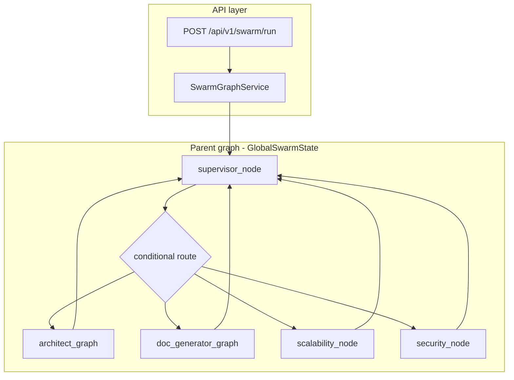
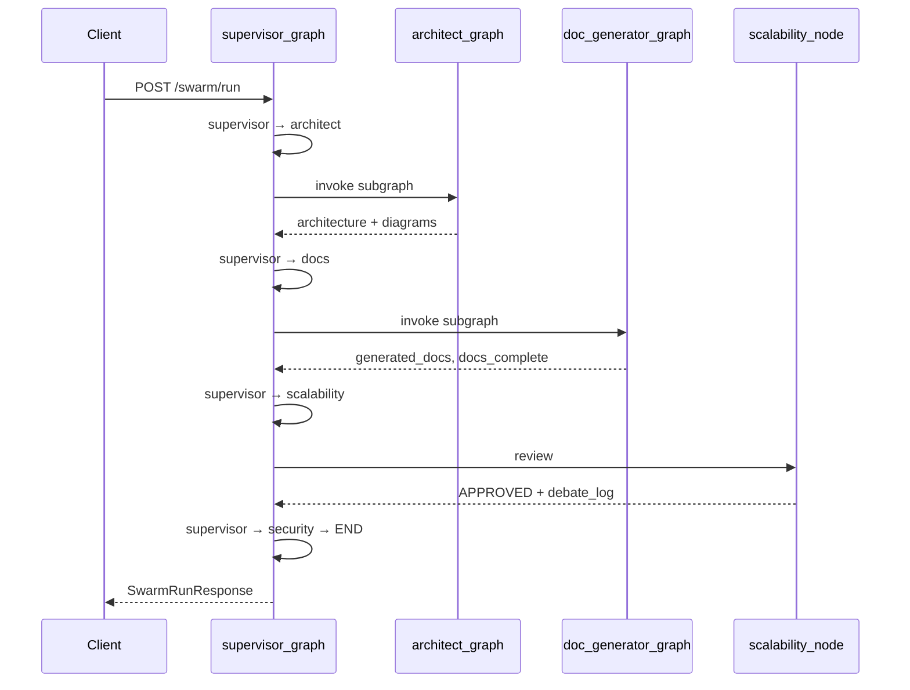

# How the swarm graph works

**Audience:** Developers and agents reading the codebase for the first time.

**Live code wins:** If anything here disagrees with Python under `app/agent/`, trust the code and update this doc.

**Prerequisites:** Basic LangGraph concepts (nodes, edges, state, checkpoints). For merge semantics (reducers vs replace), read [state-merge-and-artifacts.md](../flows/state-merge-and-artifacts.md) next.

---

## 1. What this system does

A client sends a **system design requirement** (natural language). The backend runs a **LangGraph swarm** and returns structured state:

- `architecture_json` and `component_list`
- Many **Mermaid diagrams** (`generated_diagrams`)
- Many **Markdown documents** (`generated_docs`) written under `output/reports/{thread_id}/`
- Optional **reviewer feedback** and `debate_logs` when scalability/security nodes run

The same `thread_id` can **resume** a checkpointed run via the API.

---

## 2. Layers from HTTP to LLM



| Layer | Responsibility | Key files |
|-------|----------------|-----------|
| API | Validate request, offload sync `invoke` to thread pool | `app/api/v1/endpoints/swarm.py` |
| Service | Compile graph once, empty initial state, checkpoint config | `app/services/swarm_graph_service.py` |
| Parent graph | Route between phases; own `MemorySaver` | `app/agent/graphs/supervisor_graph.py` |
| Subgraphs | Architect (draft + diagrams) and docs (Markdown) | `architect_graph.py`, `doc_generator_graph.py` |
| Subagents | Prompts, structured output, node bodies | `app/agent/subagents/` |
| State types | `GlobalSwarmState`, subgraph states, worker states | `app/agent/state/schema.py` |

---

## 3. Three compiled graphs, three state types

| Graph | State type | Role |
|-------|------------|------|
| `supervisor_graph` | `GlobalSwarmState` | Orchestration loop, reviewers, checkpoint owner |
| `architect_graph` | `ArchitectGraphState` | Draft architecture, plan diagrams, parallel generation |
| `doc_generator_graph` | `DocGraphState` | Parallel Markdown from `doc_plan` |

The parent mounts compiled subgraphs with `add_node("architect_graph", architect_graph)`. Subgraph outputs merge into `GlobalSwarmState` using **plain list replace** for artifacts (see [state-merge-and-artifacts.md](../flows/state-merge-and-artifacts.md)).

---

## 4. Parent graph: supervisor loop

**File:** [`supervisor_graph.py`](../../app/agent/graphs/supervisor_graph.py)

```text
START → supervisor_node → [conditional] → architect_graph | doc_generator_graph
                                        | scalability_node | security_node | END
(each branch) → supervisor_node
```

**Routing** is deterministic (no LLM) in [`supervisor_router.py`](../../app/agent/subagents/supervisor_router.py):

| Order | Condition | Next node |
|-------|-----------|-----------|
| 1 | `component_list` empty | `architect_graph` |
| 2 | `docs_complete` is false | `doc_generator_graph` |
| 3 | `scalability_feedback` contains `REJECTED` | `architect_graph` |
| 4 | `scalability_feedback` empty | `scalability_node` |
| 5 | `security_feedback` contains `REJECTED` | `architect_graph` |
| 6 | `security_feedback` empty | `security_node` |
| 7 | else | `END` |

**Iteration cap:** `supervisor_node` increments `iteration_count` each lap. When `iteration_count >= 5` (`MAX_ITERATIONS`), it routes to `END` regardless of pending work.

**Checkpointer:** `MemorySaver` on the parent graph. Config: `{"configurable": {"thread_id": "<id>"}}` via [`swarm_config()`](../../app/agent/run.py).

---

## 5. Architect subgraph (diagrams)

**File:** [`architect_graph.py`](../../app/agent/graphs/architect_graph.py)

```text
START → prepare_architect_artifacts_node
     → draft_architecture_node
     → score_complexity_node
     → [diagram_planner_node: Send × N]
     → diagram_generator_node (parallel)
     → reduce_diagrams_node
     → END
```

### Step-by-step

1. **`prepare_architect_artifacts_node`** ([`artifact_reset.py`](../../app/agent/subagents/artifact_reset.py))  
   Clears `generated_diagrams`, `generated_docs`, sets `docs_complete=False` so each architect pass starts clean.

2. **`draft_architecture_node`** ([`lead_architect.py`](../../app/agent/subagents/lead_architect.py))  
   LLM structured output → `architecture_json`, `component_list`, `current_architecture_mermaid`.  
   If revising after reviewer rejection, injects prior feedback and clears reviewer string fields.

3. **`score_complexity_node`** ([`comlexity_analyzer.py`](../../app/agent/subagents/comlexity_analyzer.py))  
   Sets `complexity_score`, `diagram_plan`, `doc_plan` (used later by doc subgraph).

4. **`diagram_planner_node`** (conditional edge, not `add_node`)  
   Returns `list[Send]` — one isolated [`DiagramWorkerState`](../../app/agent/state/schema.py) per `diagram_plan` entry.

5. **`diagram_generator_node`** ([`diagram_generator_worker.py`](../../app/agent/subagents/diagram_generator_worker.py))  
   LLM Mermaid + [`mermaid_linter`](../../app/agent/tools/mermaid_linter.py) retry loop. Returns one `DiagramEntry` per worker; **subgraph reducer appends**.

6. **`reduce_diagrams_node`** ([`reduce_diagrams.py`](../../app/agent/subagents/reduce_diagrams.py))  
   Drops `syntax_error` entries; `Overwrite(valid_diagrams)` inside subgraph.

When the subgraph returns to the parent, `generated_diagrams` **replaces** the parent field (no duplicate append).

---

## 6. Doc subgraph (Markdown)

**File:** [`doc_generator_graph.py`](../../app/agent/graphs/doc_generator_graph.py)

```text
START → prepare_doc_artifacts_node
     → [doc_planner_node: Send × M]
     → document_generator_node (parallel)
     → reduce_docs_node
     → END
```

### Step-by-step

1. **`prepare_doc_artifacts_node`** — clears `generated_docs`, `docs_complete=False`.

2. **`doc_planner_node`** — `Send` per `doc_plan` filename with [`DocWorkerState`](../../app/agent/state/schema.py), including a snapshot of `generated_diagrams` for pairing.

3. **`document_generator_node`** — LLM Markdown; [`file_store.save_doc`](../../app/agent/storage/file_store.py) → `output/reports/{thread_id}/{filename}`.

4. **`reduce_docs_node`** — `Overwrite(all_docs)`, `docs_complete=True`.

Docs **read** diagrams from parent state; they do not regenerate diagrams. Parent merge must not re-append diagram lists when the doc subgraph returns (see merge doc).

---

## 7. Reviewers (parent nodes, not subgraphs)

| Node | File | Writes |
|------|------|--------|
| `scalability_node` | `scalability_expert.py` | `scalability_feedback`, `debate_logs` |
| `security_node` | `security_auditor.py` | `security_feedback`, `debate_logs` |

Both call `get_chat_llm()` with adversarial prompts. Response must end with `STATUS: APPROVED` or `STATUS: REJECTED`.

`debate_logs` is built with [`append_debate_log()`](../../app/agent/subagents/reviewer_common.py) (full list returned; parent replaces the field).

`REJECTED` → supervisor sends flow back to **`architect_graph`** → prepare clears stale artifacts → docs run again when `docs_complete` is false.

---

## 8. Typical happy path



---

## 9. Artifacts on disk vs in state

| Artifact | In state | On disk |
|----------|----------|---------|
| Diagrams | `DiagramEntry.content`, logical `path` | `save_diagram` exists on `FileStore` but diagram workers do **not** call it yet — content is API/checkpoint state |
| Docs | `DocEntry.content`, `path` | `output/reports/{thread_id}/*.md` via `save_doc` |

Paths use `thread_id` from the request so concurrent runs do not collide.

---

## 10. Pairing diagrams and docs

Both plans come from the complexity analyzer. Live pairing behavior is:

- Diagram plan entries like `component-api-gateway` produce diagram `component_slug="api-gateway"` via [`_slug_from_entry`](../../app/agent/subagents/diagram_planner.py)
- Doc filenames like `component-api-gateway.md` produce doc `component_slug="component-api-gateway"` via [`slug_from_doc_filename`](../../app/agent/subagents/doc_planner.py)
- `overview.md` maps to `component_slug=""` and pairs with the `overview` diagram
- `adr-*.md` and `runbook-*.md` also map to `component_slug=""` and are treated as cross-cutting docs

Doc workers look for a paired diagram with [`_find_paired_diagram`](../../app/agent/subagents/document_generator_worker.py) and add a **Related Diagrams** section when a path exists.

**Current limitation:** component docs do not currently pair to component diagrams by exact `component_slug`, because the doc path keeps the `component-` prefix while the diagram path strips it. Overview pairing works; component pairing needs slug normalization code, not just doc changes.

---

## 11. API surface

| Method | Path | Purpose |
|--------|------|---------|
| `POST` | `/api/v1/swarm/run` | New run with `task_requirement` + `thread_id` |
| `POST` | `/api/v1/swarm/resume` | Continue checkpointed thread |
| `GET` | `/api/v1/swarm/state/{thread_id}` | Checkpoint summary + full `values` |
| `GET` | `/health` | Health check |

Response shaping: [`app/schemas/swarm.py`](../../app/schemas/swarm.py), [`build_checkpoint_payload`](../../app/agent/run.py).

---

## 12. Code map (quick reference)

| Question | Where to look |
|----------|----------------|
| Parent wiring | `app/agent/graphs/supervisor_graph.py` |
| Architect wiring | `app/agent/graphs/architect_graph.py` |
| Doc wiring | `app/agent/graphs/doc_generator_graph.py` |
| Routing rules | `app/agent/subagents/supervisor_router.py` |
| State fields | `app/agent/state/schema.py` |
| Reset on rerun | `app/agent/subagents/artifact_reset.py` |
| Initial empty state | `app/services/swarm_graph_service.py` → `_empty_swarm_state` |
| LLM client | `app/core/llm.py` → `get_chat_llm()` |

---

## 13. Not wired (files exist, graph does not call them)

- `deep_dive.py`, `summarize.py`
- `app/agent/router/supervisor_router.py` (`route_after_complexity` rehearsal only)

See [project-state.md](project-state.md) for an up-to-date gap list.

---

## 14. Further reading

| Doc | Topic |
|-----|--------|
| [state-merge-and-artifacts.md](../flows/state-merge-and-artifacts.md) | Reducers, duplicates, resets |
| [swarm-graph-overview.md](../flows/swarm-graph-overview.md) | Full topology tables, dependency diagram |
| [phase-7-flow.md](../flows/phase-7-flow.md) | Diagram `Send`, lint loop |
| [phase-8-flow.md](../flows/phase-8-flow.md) | Doc `Send`, disk layout |
| [architecture/plan.md](../architecture/plan.md) | Target design (roadmap) |
