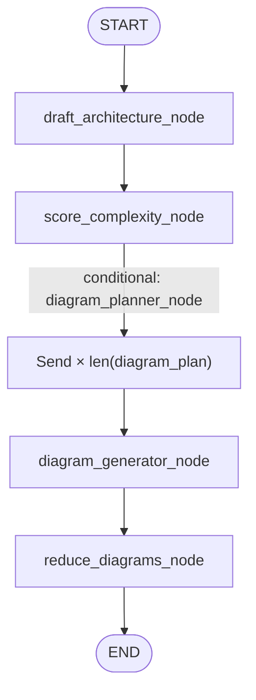
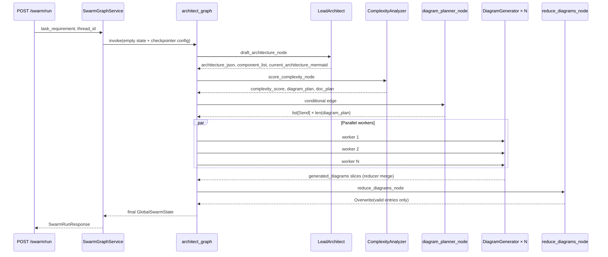
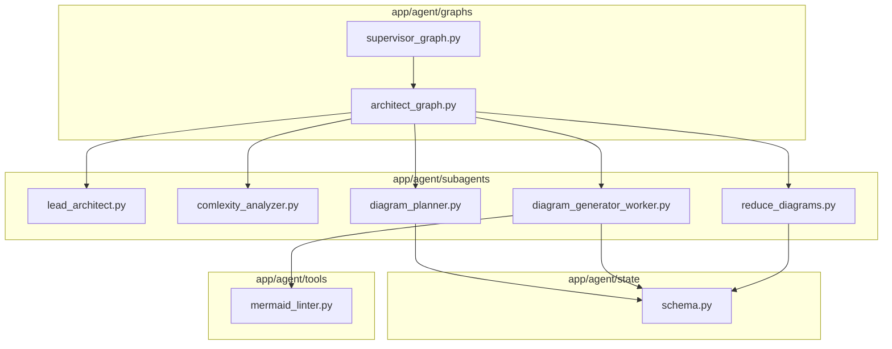

# Phase 7: Map-Reduce with `Send` (Parallel Diagram Workers)

Implementation reference for [Phase 7](../learning/langchain-langgraph-build-plan.md#phase-7--map-reduce-with-send-parallel-diagram-workers) in `app/agent/`. If this file disagrees with code, trust the code.

**Prerequisite:** [phase-6-flow.md](phase-6-flow.md) (`generated_diagrams` reducer and `DiagramEntry`). **Prior graph work:** [phase-5-flow.md](phase-5-flow.md).

---

## 1. Goal

After complexity scoring produces `diagram_plan`, fan out **one diagram worker per plan entry** at runtime (N unknown at compile time), merge results into `generated_diagrams` via the Phase 6 reducer, then run a reduce step that drops failed diagrams.

---

## 2. Architect sub-graph topology (live)



Wiring: `app/agent/graphs/architect_graph.py`.

- `diagram_planner_node` is **not** `add_node`—it is the **routing function** on a conditional edge from `score_complexity_node`.
- Returning `list[Send]` triggers parallel `diagram_generator_node` invocations.
- `reduce_diagrams_node` runs only after **all** `Send` branches complete.

Parent graph (`supervisor_graph.py`) is now `START → architect_graph → doc_generator_graph → END` (Phase 8). See [swarm-graph-overview.md](swarm-graph-overview.md).

---

## 3. Module map

| File | Responsibility |
|------|----------------|
| `app/agent/graphs/architect_graph.py` | Topology: draft → complexity → fan-out → reduce → `END` |
| `app/agent/subagents/diagram_planner.py` | `list[Send]` from `diagram_plan` |
| `app/agent/subagents/diagram_generator_worker.py` | LLM + Mermaid lint retry per entry |
| `app/agent/subagents/reduce_diagrams.py` | Filter failures; `Overwrite` on `generated_diagrams` |
| `app/agent/tools/mermaid_linter.py` | Local syntax gate |
| `app/agent/state/schema.py` | `DiagramWorkerState` (worker-isolated state) |
| `app/agent/subagents/comlexity_analyzer.py` | Produces `diagram_plan` (upstream of fan-out) |

---

## 4. `DiagramWorkerState`

Each `Send` gets an **isolated** state object; workers cannot see each other.

| Field | Source / use |
|-------|----------------|
| `diagram_type` | One `diagram_plan` entry |
| `component_slug` | From `_slug_from_entry` in `diagram_planner.py` |
| `task_requirement`, `architecture_json` | Copied from `GlobalSwarmState` |
| `draft_mermaid`, `linter_errors`, `internal_loop_count` | On TypedDict for lint loop; worker mostly uses local `messages` today |
| `thread_id`, `iteration` | Used in `DiagramEntry.path`; see [§8 gaps](#8-differences-from-the-build-plan-and-known-gaps) |

`ArchitectInternalState` in `schema.py` is **not** used by Phase 7 workers.

---

## 5. Diagram planner

```python
def diagram_planner_node(state: GlobalSwarmState) -> list[Send]:
    return [
        Send("diagram_generator_node", DiagramWorkerState(...))
        for entry in state["diagram_plan"]
    ]
```

`_slug_from_entry`:

- `"component-api-gateway"` → `component_slug="api-gateway"`
- `"overview"`, `"auth-flow"`, … → `component_slug=""`

`diagram_plan` comes from `ComplexityAnalyzer.score_complexity_node` (structured `ComplexityOutput`). Slug rules live in that subagent’s system prompt (`component-*` prefix, aligned with `doc_plan` for Phase 8).

The `Send` target name must match `add_node` exactly: `"diagram_generator_node"`.

---

## 6. Diagram generator worker

`DiagramGenerator.diagram_generator_node` in `diagram_generator_worker.py`:

1. Prompt from `diagram_type`, `architecture_json`, `task_requirement`.
2. `get_chat_llm()` (`app/core/llm.py`).
3. Strip markdown fences.
4. `mermaid_linter.invoke({"diagram": ...})` — up to **3** attempts with repair messages.
5. Success → `{"generated_diagrams": [DiagramEntry(...)]}` (one entry; Phase 6 reducer appends).
6. Exhausted retries → `content="syntax_error"`, `path=""` (reduce step removes these).

---

## 7. Reduce node and `Overwrite`

`reduce_diagrams_node`:

- Reads merged `generated_diagrams` from `GlobalSwarmState`.
- Drops `content == "syntax_error"`.
- Returns `{"generated_diagrams": Overwrite(valid_diagrams)}`.

`Overwrite` prevents a second `operator.add` merge from duplicating entries when replacing the list with the cleaned result.

Phase 6 reducer: [phase-6-flow.md](phase-6-flow.md).

---

## 8. Differences from the build plan and known gaps

| Build plan | Current implementation |
|------------|-------------------------|
| `output/{thread_id}/*.mmd` on disk | **Paths only** in `DiagramEntry.path`; no file store |
| `iteration_count` on `GlobalSwarmState` | Planners use `state.get("iteration_count", 1)` until Phase 9 |
| `write_state_node` after reduce | Not implemented — reduce is last architect node |
| `ArchitectInternalState` for lint | Worker uses `DiagramWorkerState` + message history |
| Swarm entry | FastAPI `POST /api/v1/swarm/run` via `SwarmGraphService` |

`current_architecture_mermaid` still comes from **lead architect** at draft. Phase 7 adds **extra** diagrams per `diagram_plan`, not a separate overview-only pipeline.

---

## 9. End-to-end flow



### Initial and final state

`SwarmGraphService._empty_swarm_state` sets `generated_diagrams: []`.

After a full run:

- `diagram_plan` from complexity analyzer.
- `len(generated_diagrams)` ≤ `len(diagram_plan)` (failures stripped at reduce).
- Valid entries include Mermaid `content` and logical `path`.

For K components, plans often include `overview` + K `component-*` entries + optional cross-cutting ids.

---

## 10. API and checkpoints

| Surface | Behavior |
|---------|----------|
| `SwarmRunResponse` | Full `generated_diagrams` including `content` (`app/schemas/swarm.py`) |
| `GET /api/v1/swarm/state/{thread_id}` | Summary via `diagram_checkpoint_items` in `app/agent/run.py`; full state in `values` |

Tests: `tests/test_checkpoint_payload.py`.

---

## 11. Dependency diagram (`app/agent`)



---

## 12. Verification checklist

| # | Criterion | How |
|---|-----------|-----|
| 1 | Graph wires planner, worker, reduce | `app/agent/graphs/architect_graph.py` |
| 2 | Fan-out count = `len(diagram_plan)` | Run swarm; log `[diagram_planner] fanning out N workers` |
| 3 | Reducer merges parallel slices | Phase 6 tests + multi-diagram API response |
| 4 | Failed lint excluded | `syntax_error` dropped in reduce logs |
| 5 | API returns diagrams | `POST /api/v1/swarm/run` with valid LLM config |

---

## 13. What comes next

- **Phase 8** — implemented; see [phase-8-flow.md](phase-8-flow.md).
- **Phase 9** — supervisor routing, `iteration_count` on shared state.
- **Diagram disk** — `FileStore.save_diagram` exists; diagram workers do not call it yet.

---

## 14. Related docs

- [phase-6-flow.md](phase-6-flow.md) — reducers and `DiagramEntry`
- [phase-5-flow.md](phase-5-flow.md) — sub-graph shell
- [langchain-langgraph-build-plan.md](../learning/langchain-langgraph-build-plan.md)
- [current/project-state.md](../current/project-state.md)
- [changes/2026-05-28-diagram-generation-foundation.md](../changes/2026-05-28-diagram-generation-foundation.md)
