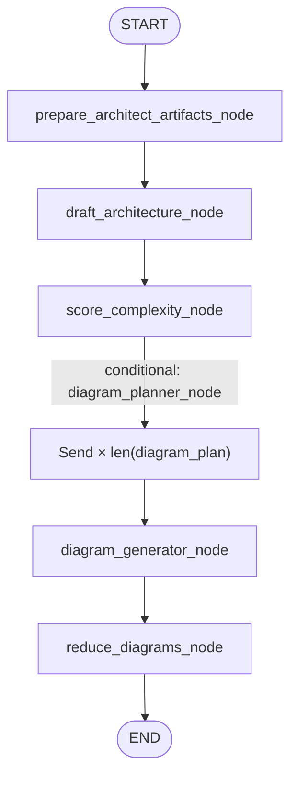

# Phase 7: Map-Reduce with `Send` (parallel diagram workers)

Implementation reference for diagram fan-out in `app/agent/`. If this disagrees with code, trust the code.

**Prerequisites:** [state-merge-and-artifacts.md](state-merge-and-artifacts.md) (`ArchitectGraphState` reducer). **Overview:** [swarm-graph-overview.md](swarm-graph-overview.md).

---

## 1. Goal

After complexity scoring produces `diagram_plan`, fan out **one diagram worker per plan entry** at runtime, merge into `ArchitectGraphState.generated_diagrams` via `operator.add`, then reduce to a clean list before the subgraph returns to the parent.

---

## 2. Architect sub-graph topology (live)



Wiring: [`architect_graph.py`](../../app/agent/graphs/architect_graph.py).

- `prepare_architect_artifacts_node` clears prior diagrams/docs — [`artifact_reset.py`](../../app/agent/subagents/artifact_reset.py)
- `diagram_planner_node` is a **conditional edge** from `score_complexity_node`, not `add_node`
- `reduce_diagrams_node` runs only after **all** `Send` branches complete

Parent: cyclic [`supervisor_graph.py`](../../app/agent/graphs/supervisor_graph.py). See [how-the-swarm-graph-works.md](../current/how-the-swarm-graph-works.md).

---

## 3. Module map

| File | Responsibility |
|------|----------------|
| `app/agent/graphs/architect_graph.py` | Topology |
| `app/agent/subagents/artifact_reset.py` | Clear artifacts @ START |
| `app/agent/subagents/diagram_planner.py` | `list[Send]` from `diagram_plan` |
| `app/agent/subagents/diagram_generator_worker.py` | LLM + Mermaid lint retry |
| `app/agent/subagents/reduce_diagrams.py` | Filter failures; `Overwrite` |
| `app/agent/tools/mermaid_linter.py` | Syntax gate |
| `app/agent/state/schema.py` | `DiagramWorkerState`, `ArchitectGraphState` |
| `app/agent/subagents/comlexity_analyzer.py` | Produces `diagram_plan` |

---

## 4. `DiagramWorkerState`

Each `Send` gets an **isolated** copy; workers cannot see each other.

| Field | Use |
|-------|-----|
| `diagram_type` | One `diagram_plan` entry |
| `component_slug` | From `_slug_from_entry` in planner |
| `task_requirement`, `architecture_json` | Copied from subgraph state |
| `thread_id`, `iteration` | Used in Cloudinary `storage_key` for `DiagramEntry` |

Planner signature: `diagram_planner_node(state: ArchitectGraphState) -> list[Send]`.

---

## 5. Diagram planner

```python
def diagram_planner_node(state: ArchitectGraphState) -> list[Send]:
    return [
        Send("diagram_generator_node", DiagramWorkerState(...))
        for entry in state["diagram_plan"]
    ]
```

`_slug_from_entry`:

- `"component-api-gateway"` → `component_slug="api-gateway"`
- `"overview"`, `"auth-flow"`, … → `component_slug=""`

The `Send` target name must match `add_node` exactly: `"diagram_generator_node"`.

---

## 6. Diagram generator worker

`DiagramGenerator.diagram_generator_node`:

1. Prompt from plan entry + architecture
2. `get_chat_llm()` + strip fences
3. `mermaid_linter` — up to **3** attempts
4. Success → upload via [`artifact_store.upload_diagram`](../../app/agent/storage/file_store.py) → `{"generated_diagrams": [DiagramEntry(...)]}` (one entry; subgraph reducer appends)
5. Failure after 3 attempts → `storage_key=""`, `url=""` (dropped at reduce)

---

## 7. Reduce node

`reduce_diagrams_node` on `ArchitectGraphState`:

- Drops entries with empty `storage_key` or `url`
- Returns `{"generated_diagrams": Overwrite(valid_diagrams)}`

`Overwrite` collapses worker accumulation **inside the subgraph**. When the subgraph exits, the parent **replaces** `GlobalSwarmState.generated_diagrams` (plain list) — see [state-merge-and-artifacts.md](state-merge-and-artifacts.md).

---

## 8. Known gaps

| Topic | Status |
|-------|--------|
| Component doc ↔ diagram pairing | `slug_from_doc_filename` keeps `component-` prefix; diagram slugs strip it — overview pairs correctly |
| Overview Mermaid | `current_architecture_mermaid` from lead architect; per-plan diagrams added by parallel workers |

---

## 9. Verification

| # | Criterion | How |
|---|-----------|-----|
| 1 | Prepare + planner + worker + reduce wired | `architect_graph.py` |
| 2 | Fan-out count = `len(diagram_plan)` | Log `[diagram_planner] fanning out N workers` |
| 3 | Subgraph reducer merges workers | `tests/test_reducer_phase6.py` |
| 4 | Parent not duplicating on return | `tests/test_subgraph_artifact_accumulation.py` |
| 5 | API returns diagrams | `POST /api/v1/swarm/run` |

---

## 10. Related docs

- [state-merge-and-artifacts.md](state-merge-and-artifacts.md)
- [phase-8-flow.md](phase-8-flow.md)
- [how-the-swarm-graph-works.md](../current/how-the-swarm-graph-works.md)
- [changes/2026-05-28-diagram-generation-foundation.md](../changes/2026-05-28-diagram-generation-foundation.md)
