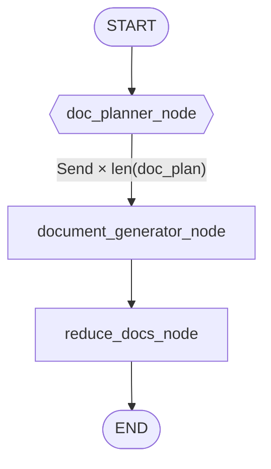
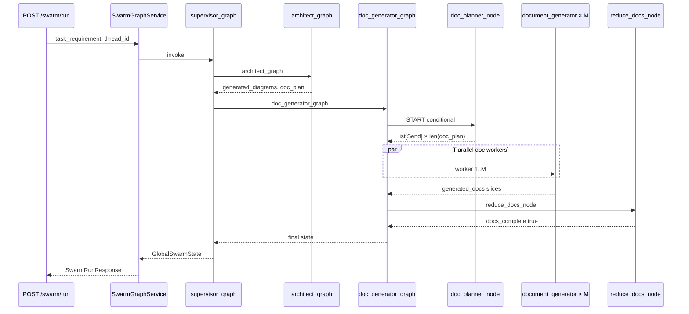

# Phase 8: Doc sub-graph with `Send` (parallel Markdown workers)

Implementation reference for [Phase 8](../learning/langchain-langgraph-build-plan.md#phase-8--doc-sub-graph-parallel-markdown-workers) in `app/agent/`. If this file disagrees with code, trust the code.

**Prerequisites:** [phase-6-flow.md](phase-6-flow.md) (reducers), [phase-7-flow.md](phase-7-flow.md) (diagram `Send`). **Full graph:** [swarm-graph-overview.md](swarm-graph-overview.md).

---

## 1. Goal

After the architect sub-graph produces `generated_diagrams`, fan out **one document worker per `doc_plan` entry**, merge into `generated_docs` via the same reducer pattern as diagrams, persist Markdown to disk, and set **`docs_complete`** for Phase 9 supervisor routing.

---

## 2. Parent graph change (Phase 8)

Previously: `START → architect_graph → END`.

Now ([`supervisor_graph.py`](../../app/agent/graphs/supervisor_graph.py)):

```text
START → architect_graph → doc_generator_graph → END
```

```17:22:app/agent/graphs/supervisor_graph.py
        builder.add_node("architect_graph", architect_graph)
        builder.add_node("doc_generator_graph", doc_generator_graph)

        builder.add_edge(START, "architect_graph")
        builder.add_edge("architect_graph", "doc_generator_graph")
        builder.add_edge("doc_generator_graph", END)
```

Phase 9 replaces sequential edges with a cyclic `supervisor_node` and conditional routing.

---

## 3. Doc sub-graph topology



Wiring: [`app/agent/graphs/doc_generator_graph.py`](../../app/agent/graphs/doc_generator_graph.py).

- `doc_planner_node` is **not** `add_node` — conditional edge from `START` (lines 17–18).
- Workers read **`generated_diagrams`** copied into each `DocWorkerState` at fan-out.

---

## 4. Module map

| File | Responsibility |
|------|----------------|
| [`doc_generator_graph.py`](../../app/agent/graphs/doc_generator_graph.py) | Topology: fan-out → reduce → `END` |
| [`doc_planner.py`](../../app/agent/subagents/doc_planner.py) | `list[Send]` from `doc_plan` |
| [`document_generator_worker.py`](../../app/agent/subagents/document_generator_worker.py) | LLM Markdown + pairing + disk write |
| [`reduce_docs.py`](../../app/agent/subagents/reduce_docs.py) | `docs_complete = True` |
| [`storage/file_store.py`](../../app/agent/storage/file_store.py) | Local `output/reports/...` |
| [`schema.py`](../../app/agent/state/schema.py) | `DocEntry`, `DocWorkerState`, `generated_docs` reducer |

---

## 5. Fan-out strategy (code)

Same pattern as Phase 7 — see [swarm-graph-overview.md §3.3](swarm-graph-overview.md#33-document-fan-out-phase-8).

```18:39:app/agent/subagents/doc_planner.py
def doc_planner_node(state: GlobalSwarmState) -> list[Send]:
    ...
    return [
        Send(
            "document_generator_node",
            DocWorkerState(
                doc_filename=filename,
                component_slug=slug_from_doc_filename(filename),
                ...
                generated_diagrams=state.get("generated_diagrams") or [],
                thread_id=state.get("thread_id") or "default",
                ...
            ),
        )
        for filename in state["doc_plan"]
    ]
```

**Rules:**

1. Return type is `list[Send]`, not a state dict.
2. `Send` first argument must equal `add_node` name: `"document_generator_node"`.
3. Worker count = `len(doc_plan)` at runtime (unknown at compile time).
4. LangGraph runs `reduce_docs_node` only after **all** workers finish.

---

## 6. `DocWorkerState`

Defined in [`schema.py`](../../app/agent/state/schema.py) (lines 61–68). Each `Send` gets an isolated copy; workers cannot see each other.

| Field | Use |
|-------|-----|
| `doc_filename` | One `doc_plan` entry (e.g. `api-gateway.md`) |
| `component_slug` | Pairing key — from [`slug_from_doc_filename`](../../app/agent/subagents/doc_planner.py) |
| `generated_diagrams` | Snapshot from parent state for citations |
| `thread_id` | Path prefix `reports/{thread_id}/...` |

---

## 7. Document generator worker

[`document_generator_node`](../../app/agent/subagents/document_generator_worker.py):

1. Resolve paired diagram path via [`_find_paired_diagram`](../../app/agent/subagents/document_generator_worker.py).
2. Prompt includes architecture + diagram path list + paired path.
3. [`get_chat_llm()`](../../app/core/llm.py) + [`assistant_text`](../../app/agent/subagents/llm_reply.py).
4. [`file_store.save_doc`](../../app/agent/storage/file_store.py) → `output/reports/{thread_id}/{filename}`.
5. Return `{"generated_docs": [DocEntry(...)]}` — one entry; reducer appends.

System prompt requires a **"## Related Diagrams"** section when a paired path exists (lines 8–21 in worker file).

---

## 8. Reduce node

[`reduce_docs_node`](../../app/agent/subagents/reduce_docs.py):

```16:17:app/agent/subagents/reduce_docs.py
    # Do not re-emit generated_docs — operator.add would duplicate worker entries.
    return {"docs_complete": True}
```

Unlike diagram reduce, there is no `Overwrite` — workers only append once; reduce only flips the completion flag.

---

## 9. State and API

### New `GlobalSwarmState` fields

```21:22:app/agent/state/schema.py
    generated_docs: Annotated[list[DocEntry], operator.add]
    docs_complete: bool  # set True when doc sub-graph finishes (Phase 9 supervisor gate)
```

Initial state: [`_empty_swarm_state`](../../app/services/swarm_graph_service.py) sets `generated_docs: []`, `docs_complete: False`, `thread_id`.

### API response ([`SwarmRunResponse`](../../app/schemas/swarm.py))

- `generated_docs[]` — `title`, `component_slug`, `content`, `path`
- `docs_complete` — must be `true` after full run
- `thread_id` — matches request and file paths

### Checkpoint GET

[`SwarmCheckpointResponse`](../../app/schemas/swarm.py): `generated_doc_count`, summary `generated_docs` (no full Markdown), `docs_complete`. Full bodies in `values`.

---

## 10. End-to-end sequence



---

## 11. Verification checklist

| # | Criterion | How |
|---|-----------|-----|
| 1 | Doc graph wired | `doc_generator_graph.py` |
| 2 | Fan-out = `len(doc_plan)` | Log `[doc_planner] fanning out N workers` |
| 3 | Reducer merges docs | `tests/test_reducer_phase8.py` |
| 4 | `docs_complete` true | API response after full run |
| 5 | Pairing | Same `component_slug` on doc + diagram entries |
| 6 | Disk | `output/reports/{thread_id}/*.md` |

---

## 12. Related docs

- [swarm-graph-overview.md](swarm-graph-overview.md) — entire graph + both fan-outs
- [phase-7-flow.md](phase-7-flow.md) — diagram `Send`
- [phase-6-flow.md](phase-6-flow.md) — `operator.add` reducers
- [current/project-state.md](../current/project-state.md)
