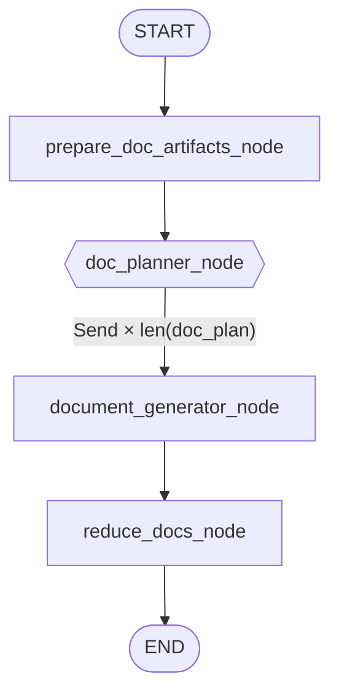
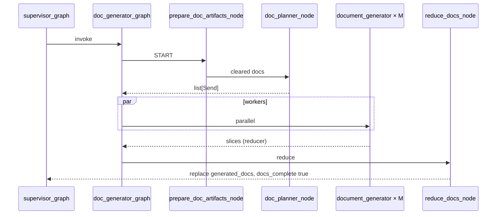

# Phase 8: Doc sub-graph with `Send` (parallel Markdown workers)

Implementation reference for document fan-out in `app/agent/`. If this disagrees with code, trust the code.

**Prerequisites:** [state-merge-and-artifacts.md](state-merge-and-artifacts.md), [phase-7-flow.md](phase-7-flow.md). **Overview:** [swarm-graph-overview.md](swarm-graph-overview.md).

---

## 1. Goal

After the architect subgraph produces `generated_diagrams`, fan out **one document worker per `doc_plan` entry**, merge into `DocGraphState.generated_docs` via `operator.add`, persist Markdown to Cloudinary, and set **`docs_complete`** for supervisor routing.

---

## 2. Parent graph (live)

Cyclic supervisor — not a fixed `architect → doc → END` chain:

```text
supervisor_node → doc_generator_graph → supervisor_node → …
```

See [`supervisor_graph.py`](../../app/agent/graphs/supervisor_graph.py) and [how-the-swarm-graph-works.md](../current/how-the-swarm-graph-works.md).

---

## 3. Doc sub-graph topology



Wiring: [`doc_generator_graph.py`](../../app/agent/graphs/doc_generator_graph.py).

- `prepare_doc_artifacts_node` clears docs before each pass — [`artifact_reset.py`](../../app/agent/subagents/artifact_reset.py)
- `doc_planner_node` is a conditional edge from `prepare_doc_artifacts_node`
- Workers receive a **snapshot** of `generated_diagrams` in `DocWorkerState`

---

## 4. Module map

| File | Responsibility |
|------|----------------|
| [`doc_generator_graph.py`](../../app/agent/graphs/doc_generator_graph.py) | Topology |
| [`artifact_reset.py`](../../app/agent/subagents/artifact_reset.py) | `prepare_doc_artifacts_node` |
| [`doc_planner.py`](../../app/agent/subagents/doc_planner.py) | `list[Send]` from `doc_plan` |
| [`document_generator_worker.py`](../../app/agent/subagents/document_generator_worker.py) | LLM + pairing + Cloudinary upload |
| [`reduce_docs.py`](../../app/agent/subagents/reduce_docs.py) | `Overwrite(all_docs)`, `docs_complete=True` |
| [`storage/file_store.py`](../../app/agent/storage/file_store.py) | `ArtifactStore` — Cloudinary raw uploads |
| [`schema.py`](../../app/agent/state/schema.py) | `DocGraphState`, `DocWorkerState` |

---

## 5. Fan-out

```python
def doc_planner_node(state: DocGraphState) -> list[Send]:
    return [
        Send(
            "document_generator_node",
            DocWorkerState(
                doc_filename=filename,
                component_slug=slug_from_doc_filename(filename),
                generated_diagrams=state.get("generated_diagrams") or [],
                ...
            ),
        )
        for filename in state["doc_plan"]
    ]
```

**Rules:**

1. Return type is `list[Send]`, not a state dict
2. `Send` target must equal `add_node` name: `"document_generator_node"`
3. Worker count = `len(doc_plan)` at runtime
4. `reduce_docs_node` runs after **all** workers finish

---

## 6. Document generator worker

1. [`_find_paired_diagram`](../../app/agent/subagents/document_generator_worker.py) for slug / overview
2. LLM Markdown (`get_chat_llm`, `assistant_text`)
3. [`artifact_store.upload_doc`](../../app/agent/storage/file_store.py) → Cloudinary raw asset; `DocEntry` carries `storage_key` + `url`
4. Return `{"generated_docs": [DocEntry(...)]}` — subgraph reducer appends

**Live pairing note:** `slug_from_doc_filename("component-api-gateway.md")` currently returns `component-api-gateway`, while diagram workers store `component_slug="api-gateway"`. That means overview pairing works, but component docs do not currently resolve a direct paired component diagram by exact slug.

---

## 7. Reduce node

[`reduce_docs_node`](../../app/agent/subagents/reduce_docs.py):

```python
return {
    "generated_docs": Overwrite(all_docs),
    "docs_complete": True,
}
```

- `Overwrite` finalizes the reducer-backed list **inside** `DocGraphState`
- Parent `GlobalSwarmState.generated_docs` is a **plain list** — subgraph return **replaces** it (no double append of the full doc list)

---

## 8. State fields

| Location | `generated_docs` | `docs_complete` |
|----------|------------------|-----------------|
| `GlobalSwarmState` (parent) | plain list | set by doc subgraph return |
| `DocGraphState` | `Annotated[..., operator.add]` | set in reduce |

Initial state: [`_empty_swarm_state`](../../app/services/swarm_graph_service.py) → `generated_docs: []`, `docs_complete: False`.

---

## 9. End-to-end sequence



---

## 10. Verification

| # | Criterion | How |
|---|-----------|-----|
| 1 | Prepare + planner + worker + reduce | `doc_generator_graph.py` |
| 2 | Fan-out = `len(doc_plan)` | `[doc_planner] fanning out N workers` |
| 3 | Subgraph reducer | `tests/test_reducer_phase8.py` |
| 4 | No parent duplication | `tests/test_subgraph_artifact_accumulation.py` |
| 5 | `docs_complete` true after doc phase | API / checkpoint |
| 6 | Cloudinary assets | `DocEntry.storage_key` / `url` populated |

---

## 11. Related docs

- [state-merge-and-artifacts.md](state-merge-and-artifacts.md)
- [phase-7-flow.md](phase-7-flow.md)
- [how-the-swarm-graph-works.md](../current/how-the-swarm-graph-works.md)
- [2026-05-30-subgraph-artifact-merge-fix.md](../changes/2026-05-30-subgraph-artifact-merge-fix.md)
