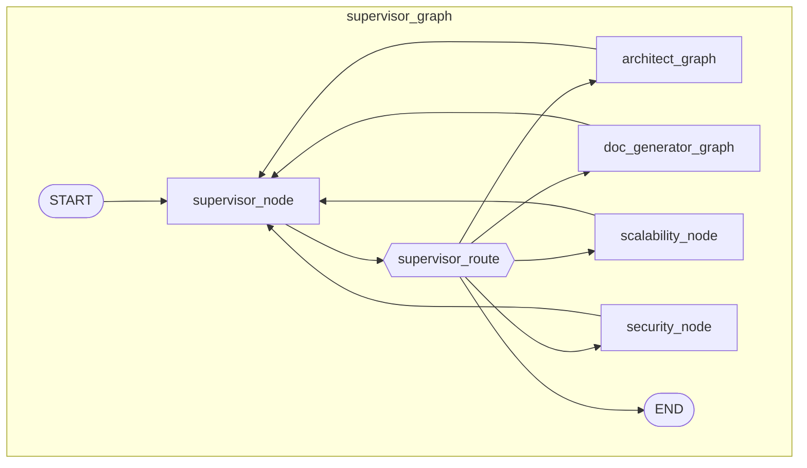
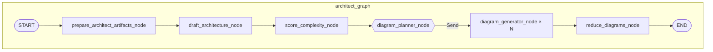
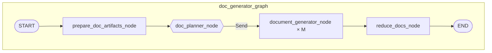
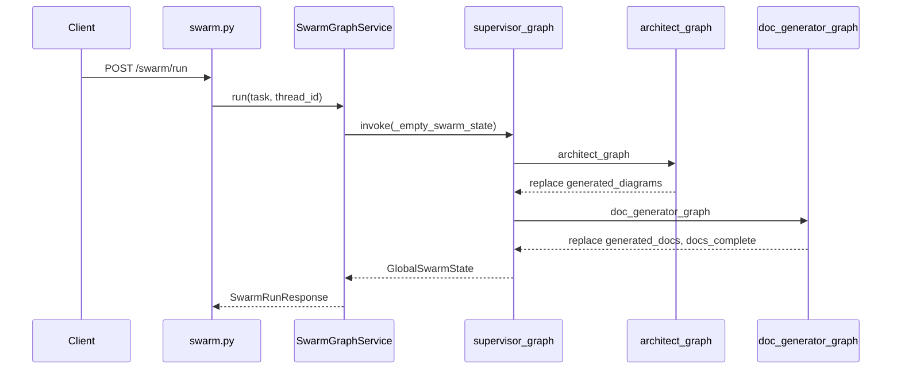
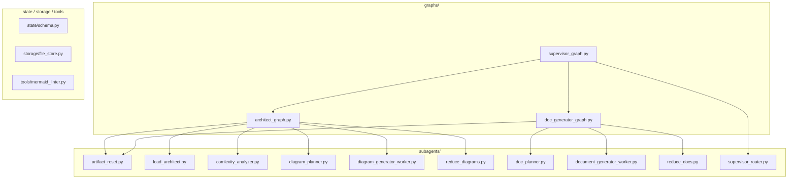

# Swarm graph overview (live topology)

Reference for compiled graphs under `app/agent/graphs/`. If this disagrees with code, trust the code.

**Read first:** [how-the-swarm-graph-works.md](../current/how-the-swarm-graph-works.md) (narrative), [state-merge-and-artifacts.md](state-merge-and-artifacts.md) (merge rules).

**Deep dives:** [phase-7-flow.md](phase-7-flow.md) (diagrams), [phase-8-flow.md](phase-8-flow.md) (docs).

**API entry:** `POST /api/v1/swarm/run` → [`SwarmGraphService`](../../app/services/swarm_graph_service.py) → [`supervisor_graph`](../../app/agent/graphs/supervisor_graph.py).

---

## 1. Three graphs, three state types

| Graph file | Export | State type | Role |
|------------|--------|------------|------|
| [`supervisor_graph.py`](../../app/agent/graphs/supervisor_graph.py) | `supervisor_graph` | `GlobalSwarmState` | Parent: routing, reviewers, checkpointer |
| [`architect_graph.py`](../../app/agent/graphs/architect_graph.py) | `architect_graph` | `ArchitectGraphState` | Draft, complexity, diagram fan-out |
| [`doc_generator_graph.py`](../../app/agent/graphs/doc_generator_graph.py) | `doc_generator_graph` | `DocGraphState` | Doc fan-out, `docs_complete` |

Parent mounts subgraphs as opaque compiled nodes. Artifact lists on **`GlobalSwarmState` are plain lists** (replace on merge). Reducers live only on subgraph fields used by parallel workers.

---

## 2. Parent topology

Routing: [`supervisor_router.py`](../../app/agent/subagents/supervisor_router.py) — see [how-the-swarm-graph-works.md §4](../current/how-the-swarm-graph-works.md#4-parent-graph-supervisor-loop).

---

## 3. Architect subgraph

| Node | Module |
|------|--------|
| `prepare_architect_artifacts_node` | [`artifact_reset.py`](../../app/agent/subagents/artifact_reset.py) |
| `draft_architecture_node` | [`lead_architect.py`](../../app/agent/subagents/lead_architect.py) |
| `score_complexity_node` | [`comlexity_analyzer.py`](../../app/agent/subagents/comlexity_analyzer.py) |
| `diagram_planner_node` | Conditional edge — [`diagram_planner.py`](../../app/agent/subagents/diagram_planner.py) |
| `diagram_generator_node` | [`diagram_generator_worker.py`](../../app/agent/subagents/diagram_generator_worker.py) |
| `reduce_diagrams_node` | [`reduce_diagrams.py`](../../app/agent/subagents/reduce_diagrams.py) |

---

## 4. Doc subgraph

| Node | Module |
|------|--------|
| `prepare_doc_artifacts_node` | [`artifact_reset.py`](../../app/agent/subagents/artifact_reset.py) |
| `doc_planner_node` | Conditional edge — [`doc_planner.py`](../../app/agent/subagents/doc_planner.py) |
| `document_generator_node` | [`document_generator_worker.py`](../../app/agent/subagents/document_generator_worker.py) |
| `reduce_docs_node` | [`reduce_docs.py`](../../app/agent/subagents/reduce_docs.py) |

---

## 5. Fan-out (`Send`)

LangGraph **map-reduce**: a routing function returns `list[Send]`. Each `Send` targets a **registered node name** with an isolated worker state. LangGraph waits for **all** branches before the reduce node.

Planners are **not** `add_node` — they are conditional-edge functions.

### Diagram fan-out (architect)

- **After:** `score_complexity_node`
- **Router:** `diagram_planner_node(state: ArchitectGraphState) -> list[Send]`
- **Target:** `"diagram_generator_node"`
- **Worker state:** `DiagramWorkerState`
- **Merge inside subgraph:** `ArchitectGraphState.generated_diagrams` uses `operator.add`
- **Reduce:** `reduce_diagrams_node` → `Overwrite(valid_diagrams)`

Details: [phase-7-flow.md](phase-7-flow.md).

### Document fan-out (doc)

- **After:** `prepare_doc_artifacts_node`
- **Router:** `doc_planner_node(state: DocGraphState) -> list[Send]`
- **Target:** `"document_generator_node"`
- **Worker state:** `DocWorkerState` (includes snapshot of `generated_diagrams`)
- **Merge inside subgraph:** `DocGraphState.generated_docs` uses `operator.add`
- **Reduce:** `reduce_docs_node` → `Overwrite(all_docs)`, `docs_complete=True`

Details: [phase-8-flow.md](phase-8-flow.md).

### Fan-out comparison

| | Diagrams | Documents |
|---|----------|-----------|
| Subgraph state | `ArchitectGraphState` | `DocGraphState` |
| Plan field | `diagram_plan` | `doc_plan` |
| Planner | `diagram_planner_node` | `doc_planner_node` |
| Worker state | `DiagramWorkerState` | `DocWorkerState` |
| Reducer field | `generated_diagrams` | `generated_docs` |
| Reduce node | `reduce_diagrams_node` | `reduce_docs_node` |
| Prepare @ START | `prepare_architect_artifacts_node` | `prepare_doc_artifacts_node` |

---

## 6. `component_slug` pairing

| `doc_plan` entry | `component_slug` | Pairs with diagram |
|------------------|------------------|--------------------|
| `overview.md` | `""` | `diagram_type == "overview"` |
| `component-*.md` | filename without `.md` (prefix preserved) | does **not** currently equal component diagram slug |
| `adr-*.md`, `runbook-*.md` | `""` | cross-cutting |

Helpers: [`slug_from_doc_filename`](../../app/agent/subagents/doc_planner.py), [`_find_paired_diagram`](../../app/agent/subagents/document_generator_worker.py).

Both plans are produced by [`ComplexityAnalyzer`](../../app/agent/subagents/comlexity_analyzer.py).

Component diagrams use [`_slug_from_entry`](../../app/agent/subagents/diagram_planner.py), which strips the `component-` prefix (`component-api-gateway` → `api-gateway`). Component docs do not currently apply the same normalization, so only overview pairing is guaranteed in the live runtime.

---

## 7. State model summary

Full definitions: [`schema.py`](../../app/agent/state/schema.py). Merge rules: [state-merge-and-artifacts.md](state-merge-and-artifacts.md).

| Field | Parent | Architect subgraph | Doc subgraph |
|-------|--------|--------------------|--------------|
| `generated_diagrams` | plain list | **reducer** | plain (input) |
| `generated_docs` | plain list | plain (cleared on prepare) | **reducer** |
| `debate_logs` | plain list | — | — |
| `docs_complete` | bool | read/write | set `True` in reduce |

---

## 8. API and service

| Surface | Code |
|---------|------|
| Routes | [`app/api/v1/endpoints/swarm.py`](../../app/api/v1/endpoints/swarm.py) |
| Service | [`app/services/swarm_graph_service.py`](../../app/services/swarm_graph_service.py) |
| Schemas | [`app/schemas/swarm.py`](../../app/schemas/swarm.py) |
| Checkpoint | [`build_checkpoint_payload`](../../app/agent/run.py) |

After a successful full run expect `docs_complete: true` and no duplicate `path` entries in artifact lists.

---

## 9. Dependency diagram

---

## 10. Not wired

| Module | Notes |
|--------|--------|
| [`deep_dive.py`](../../app/agent/subagents/deep_dive.py) | Not in any graph |
| [`summarize.py`](../../app/agent/subagents/summarize.py) | Not in any graph |
| [`router/supervisor_router.py`](../../app/agent/router/supervisor_router.py) | Rehearsal only |

---

## 11. Verification

| Check | Where |
|-------|--------|
| No duplicate artifacts across subgraphs | `tests/test_subgraph_artifact_accumulation.py` |
| Parent plain lists / subgraph reducers | `tests/test_reducer_phase6.py`, `test_reducer_phase8.py` |
| Supervisor routing | `tests/test_supervisor_routing_phase9.py` |
| Full LLM run | `POST /api/v1/swarm/run` with env configured |

---

## 12. Related docs

- [how-the-swarm-graph-works.md](../current/how-the-swarm-graph-works.md)
- [state-merge-and-artifacts.md](state-merge-and-artifacts.md)
- [2026-05-30-subgraph-artifact-merge-fix.md](../changes/2026-05-30-subgraph-artifact-merge-fix.md)
- [project-state.md](../current/project-state.md)
