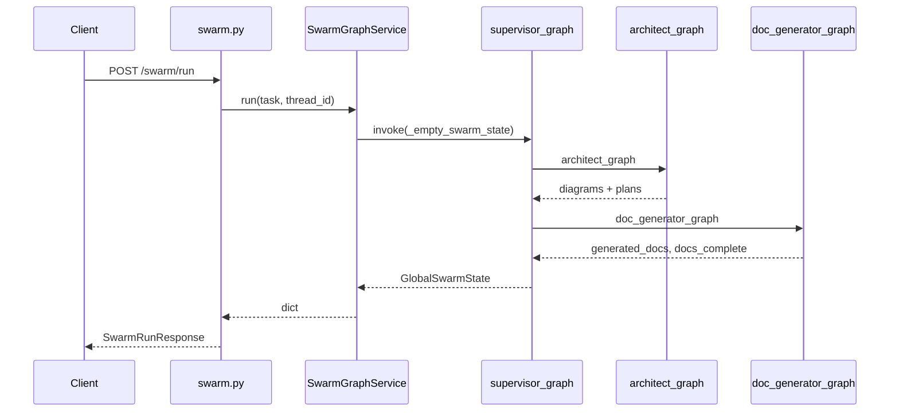
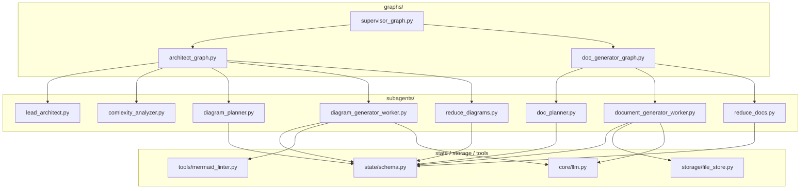

# Swarm graph overview (live topology)

Implementation reference for the **compiled graphs** under `app/agent/graphs/`. If this file disagrees with code, trust the code.

**Related phase docs:** [phase-6-flow.md](phase-6-flow.md) (reducers), [phase-7-flow.md](phase-7-flow.md) (diagram `Send`), [phase-8-flow.md](phase-8-flow.md) (doc `Send`).

**Entry point (API only):** `POST /api/v1/swarm/run` → [`SwarmGraphService`](../../app/services/swarm_graph_service.py) → parent [`supervisor_graph`](../../app/agent/graphs/supervisor_graph.py).

---

## 1. Three graphs, one shared state

All graphs use [`GlobalSwarmState`](../../app/agent/state/schema.py) from [`app/agent/state/schema.py`](../../app/agent/state/schema.py).

| Graph file | Compiled export | Role |
|------------|-----------------|------|
| [`supervisor_graph.py`](../../app/agent/graphs/supervisor_graph.py) | `supervisor_graph` | Parent: checkpointer, sequential sub-graphs |
| [`architect_graph.py`](../../app/agent/graphs/architect_graph.py) | `architect_graph` | Draft → complexity → diagram fan-out → reduce |
| [`doc_generator_graph.py`](../../app/agent/graphs/doc_generator_graph.py) | `doc_generator_graph` | Doc fan-out → reduce → `docs_complete` |

---

## 2. Full topology (Mermaid)

```mermaid
flowchart TB
  subgraph parent ["supervisor_graph.py"]
    P_START([START])
    P_ARCH["architect_graph"]
    P_DOC["doc_generator_graph"]
    P_END([END])
    P_START --> P_ARCH --> P_DOC --> P_END
  end

  subgraph architect ["architect_graph.py"]
    A_START([START])
    A_DRAFT["draft_architecture_node"]
    A_SCORE["score_complexity_node"]
    A_PLAN{{"diagram_planner_node"}}
    A_GEN["diagram_generator_node × N"]
    A_REDUCE["reduce_diagrams_node"]
    A_END([END])
    A_START --> A_DRAFT --> A_SCORE --> A_PLAN
    A_PLAN -->|"Send × len(diagram_plan)"| A_GEN
    A_GEN --> A_REDUCE --> A_END
  end

  subgraph docgen ["doc_generator_graph.py"]
    D_START([START])
    D_PLAN{{"doc_planner_node"}}
    D_GEN["document_generator_node × M"]
    D_REDUCE["reduce_docs_node"]
    D_END([END])
    D_START --> D_PLAN
    D_PLAN -->|"Send × len(doc_plan)"| D_GEN
    D_GEN --> D_REDUCE --> D_END
  end
```



Parent wiring (Phase 8 — linear; Phase 9 will add cyclic supervisor routing):

```20:22:app/agent/graphs/supervisor_graph.py
        builder.add_edge(START, "architect_graph")
        builder.add_edge("architect_graph", "doc_generator_graph")
        builder.add_edge("doc_generator_graph", END)
```

---

## 3. Fan-out strategy (`Send`)

LangGraph **map-reduce**: a routing function returns `list[Send]` instead of a state dict. Each `Send` targets a **registered node name** with an **isolated worker state** (`DiagramWorkerState` or `DocWorkerState`). Workers run in parallel; LangGraph waits for **all** branches before the reduce node.

### 3.1 Why not `add_node` for planners?

Planners are **conditional-edge functions**, not graph nodes:

- Architect: [`add_conditional_edges("score_complexity_node", diagram_planner_node)`](../../app/agent/graphs/architect_graph.py) — see lines 41–44.
- Docs: [`add_conditional_edges(START, doc_planner_node)`](../../app/agent/graphs/doc_generator_graph.py) — see lines 17–18.

### 3.2 Diagram fan-out (Phase 7)

**Trigger:** `len(state["diagram_plan"])` after complexity scoring.

**Router:** [`diagram_planner_node`](../../app/agent/subagents/diagram_planner.py) in [`app/agent/subagents/diagram_planner.py`](../../app/agent/subagents/diagram_planner.py).

```6:30:app/agent/subagents/diagram_planner.py
def diagram_planner_node(state: GlobalSwarmState) -> list[Send]:
    """
    Returns list[Send] — NOT a state dict.
    Each Send triggers one isolated diagram_generator_node invocation.
    The number of workers = len(diagram_plan), unknown until runtime.
    """
    print(f"\n[diagram_planner] fanning out {len(state['diagram_plan'])} workers")

    return [
        Send(
            "diagram_generator_node",  # must match node name exactly in architect_graph
            DiagramWorkerState(
                diagram_type=entry,
                component_slug=_slug_from_entry(entry),
                task_requirement=state["task_requirement"],
                architecture_json=state["architecture_json"],
                draft_mermaid="",
                linter_errors=[],
                internal_loop_count=0,
                thread_id=state.get("thread_id") or "default",
                iteration=state.get("iteration_count", 1),
            ),
        )
        for entry in state["diagram_plan"]
    ]
```

**Worker target:** `"diagram_generator_node"` must match [`architect_graph.py`](../../app/agent/graphs/architect_graph.py) `add_node` (lines 29–32).

**Merge:** Each worker returns `{"generated_diagrams": [DiagramEntry(...)]}`. [`GlobalSwarmState.generated_diagrams`](../../app/agent/state/schema.py) uses `Annotated[list[DiagramEntry], operator.add]` (lines 19–19) so parallel slices append instead of overwriting.

**Reduce:** [`reduce_diagrams_node`](../../app/agent/subagents/reduce_diagrams.py) filters `syntax_error` and uses `Overwrite` to replace the list (lines 6–27).

### 3.3 Document fan-out (Phase 8)

**Trigger:** `len(state["doc_plan"])` at doc sub-graph `START` (plan already set by complexity analyzer in architect phase).

**Router:** [`doc_planner_node`](../../app/agent/subagents/doc_planner.py) in [`app/agent/subagents/doc_planner.py`](../../app/agent/subagents/doc_planner.py).

```18:39:app/agent/subagents/doc_planner.py
def doc_planner_node(state: GlobalSwarmState) -> list[Send]:
    """
    Returns list[Send] — one per doc_plan entry.
    Each Send carries an isolated DocWorkerState with generated_diagrams for pairing.
    """
    print(f"\n[doc_planner] fanning out {len(state['doc_plan'])} workers")

    return [
        Send(
            "document_generator_node",
            DocWorkerState(
                doc_filename=filename,
                component_slug=slug_from_doc_filename(filename),
                task_requirement=state["task_requirement"],
                architecture_json=state["architecture_json"],
                generated_diagrams=state.get("generated_diagrams") or [],
                thread_id=state.get("thread_id") or "default",
                iteration=int(state.get("iteration_count", 1)),  # type: ignore[arg-type]
            ),
        )
        for filename in state["doc_plan"]
    ]
```

**Cross-agent read:** Doc workers receive a **copy** of `generated_diagrams` from parent state at fan-out time so they can cite paired Mermaid paths without re-running the architect sub-graph.

**Worker target:** `"document_generator_node"` must match [`doc_generator_graph.py`](../../app/agent/graphs/doc_generator_graph.py) `add_node` (line 14).

**Merge:** `generated_docs: Annotated[list[DocEntry], operator.add]` in [`schema.py`](../../app/agent/state/schema.py) (lines 21–21).

**Reduce:** [`reduce_docs_node`](../../app/agent/subagents/reduce_docs.py) sets `docs_complete: True` only — it does **not** re-emit `generated_docs` (that would double-append via `operator.add`). See lines 16–17.

### 3.4 Fan-out comparison

| | Diagrams | Documents |
|---|----------|-----------|
| Plan field | `diagram_plan` | `doc_plan` |
| Planner | `diagram_planner_node` | `doc_planner_node` |
| Worker state | `DiagramWorkerState` | `DocWorkerState` |
| Worker node | `diagram_generator_node` | `document_generator_node` |
| Reducer field | `generated_diagrams` | `generated_docs` |
| Reduce node | `reduce_diagrams_node` + `Overwrite` | `reduce_docs_node` + `docs_complete` |
| Upstream of fan-out | `score_complexity_node` | Sub-graph `START` (after architect) |

---

## 4. `component_slug` pairing invariant

Docs and diagrams link through **`component_slug`** (and `diagram_type` for overview):

| `doc_plan` entry | `component_slug` | Pairs with diagram |
|------------------|------------------|--------------------|
| `overview.md` | `""` | `diagram_type == "overview"` |
| `{slug}.md` | `{slug}` | `DiagramEntry.component_slug == slug` |
| `adr-*.md`, `runbook-*.md` | `""` | cross-cutting; cite paths in prose |

Slug from filename: [`slug_from_doc_filename`](../../app/agent/subagents/doc_planner.py) (lines 6–15).

Paired path lookup in worker: [`_find_paired_diagram`](../../app/agent/subagents/document_generator_worker.py) (lines 24–38).

Diagram slug from plan entry: [`_slug_from_entry`](../../app/agent/subagents/diagram_planner.py) (lines 32–42).

Both plans are produced together by [`ComplexityAnalyzer.score_complexity_node`](../../app/agent/subagents/comlexity_analyzer.py) using structured [`ComplexityOutput`](../../app/agent/subagents/_schema.py).

---

## 5. Node implementations (by graph)

### 5.1 Parent — [`supervisor_graph.py`](../../app/agent/graphs/supervisor_graph.py)

- Registers compiled sub-graphs as opaque nodes (lines 17–18).
- Owns [`MemorySaver`](../../app/agent/graphs/supervisor_graph.py) checkpointer (line 24).
- Config: [`swarm_config(thread_id)`](../../app/agent/run.py) in [`app/agent/run.py`](../../app/agent/run.py).

### 5.2 Architect — [`architect_graph.py`](../../app/agent/graphs/architect_graph.py)

| Node | Implementation |
|------|----------------|
| `draft_architecture_node` | [`LeadArchitect.draft_architecture_node`](../../app/agent/subagents/lead_architect.py) |
| `score_complexity_node` | [`ComplexityAnalyzer.score_complexity_node`](../../app/agent/subagents/comlexity_analyzer.py) |
| `diagram_planner_node` | Conditional router — [`diagram_planner.py`](../../app/agent/subagents/diagram_planner.py) |
| `diagram_generator_node` | [`DiagramGenerator.diagram_generator_node`](../../app/agent/subagents/diagram_generator_worker.py) — LLM + [`mermaid_linter`](../../app/agent/tools/mermaid_linter.py) |
| `reduce_diagrams_node` | [`reduce_diagrams.py`](../../app/agent/subagents/reduce_diagrams.py) |

Topology comments and edges: lines 35–48.

### 5.3 Doc generator — [`doc_generator_graph.py`](../../app/agent/graphs/doc_generator_graph.py)

| Node | Implementation |
|------|----------------|
| `doc_planner_node` | Conditional from `START` — [`doc_planner.py`](../../app/agent/subagents/doc_planner.py) |
| `document_generator_node` | [`document_generator_node`](../../app/agent/subagents/document_generator_worker.py) — LLM via [`get_chat_llm()`](../../app/core/llm.py) |
| `reduce_docs_node` | [`reduce_docs.py`](../../app/agent/subagents/reduce_docs.py) |

### 5.4 Persistence — [`file_store.py`](../../app/agent/storage/file_store.py)

Doc worker calls [`file_store.save_doc`](../../app/agent/storage/file_store.py) after generation ([`document_generator_worker.py`](../../app/agent/subagents/document_generator_worker.py) ~line 89). Files land under `output/reports/{thread_id}/{filename}`.

`save_diagram` exists on `FileStore` but diagram workers do not call it yet — diagram content lives in API state (`DiagramEntry.content`).

---

## 6. State model ([`schema.py`](../../app/agent/state/schema.py))

### GlobalSwarmState (shared)

Key fields and who writes them:

| Field | Written by |
|-------|------------|
| `task_requirement`, `thread_id` | Initial state — [`_empty_swarm_state`](../../app/services/swarm_graph_service.py) |
| `architecture_json`, `component_list`, `current_architecture_mermaid` | `draft_architecture_node` |
| `complexity_score`, `diagram_plan`, `doc_plan` | `score_complexity_node` |
| `generated_diagrams` | Diagram workers (reducer), then `reduce_diagrams_node` (`Overwrite`) |
| `generated_docs` | Doc workers (reducer) |
| `docs_complete` | `reduce_docs_node` |

Reducer annotations:

```19:22:app/agent/state/schema.py
    generated_diagrams: Annotated[list["DiagramEntry"], operator.add]
    thread_id: str  # checkpoint thread; used for artifact paths
    generated_docs: Annotated[list[DocEntry], operator.add]
    docs_complete: bool  # set True when doc sub-graph finishes (Phase 9 supervisor gate)
```

### Worker-isolated state

- [`DiagramWorkerState`](../../app/agent/state/schema.py) (lines 40–51) — one per diagram `Send`.
- [`DocWorkerState`](../../app/agent/state/schema.py) (lines 61–68) — one per doc `Send`; includes `generated_diagrams` snapshot.

### Artifacts

- [`DiagramEntry`](../../app/agent/state/schema.py) (lines 32–37)
- [`DocEntry`](../../app/agent/state/schema.py) (lines 54–58)

---

## 7. API and service layer



| Surface | Code |
|---------|------|
| Routes | [`app/api/v1/endpoints/swarm.py`](../../app/api/v1/endpoints/swarm.py) |
| Service | [`app/services/swarm_graph_service.py`](../../app/services/swarm_graph_service.py) |
| Run response schema | [`app/schemas/swarm.py`](../../app/schemas/swarm.py) — `SwarmRunResponse`, `DocEntryResponse` |
| Checkpoint shaping | [`build_checkpoint_payload`](../../app/agent/run.py), [`doc_checkpoint_items`](../../app/agent/run.py) |

After a full run, expect `generated_diagrams`, `generated_docs`, `docs_complete: true`, and `thread_id` echoed in the JSON body.

---

## 8. Dependency diagram (`app/agent`)



---

## 9. Not wired (on disk only)

| Module | Notes |
|--------|--------|
| [`deep_dive.py`](../../app/agent/subagents/deep_dive.py) | Not in any graph |
| [`summarize.py`](../../app/agent/subagents/summarize.py) | Not in any graph |
| [`supervisor_router.py`](../../app/agent/router/supervisor_router.py) | Phase 9 routing rehearsal |

---

## 10. Phase 9 preview

Target parent shape (not implemented):

```text
START → supervisor_node → [conditional] → architect_graph | doc_generator_graph | reviewers → END
```

Uses `docs_complete`, `iteration_count`, and reviewer feedback fields — see [langchain-langgraph-build-plan.md](../learning/langchain-langgraph-build-plan.md).

---

## 11. Verification

| Check | Where |
|-------|--------|
| Reducer on `generated_docs` | `tests/test_reducer_phase8.py` |
| Reducer on `generated_diagrams` | `tests/test_reducer_phase6.py` |
| Checkpoint payload | `tests/test_checkpoint_payload.py` |
| Full run | `POST /api/v1/swarm/run` with LLM env configured |
