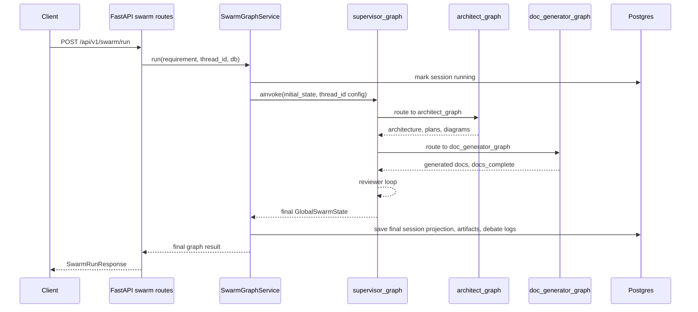

# Swarm graph overview

This document explains how the live graph pieces work together. It is the high-level map for the graph docs.

## Runtime boundary

The client does not call LangGraph directly. The request enters FastAPI, then goes through `SwarmGraphService`, which invokes the compiled parent graph.



Streaming uses the same graph/service path. The only difference is transport: the API sends sanitized SSE progress events while the graph runs, then the client reads final data by `thread_id`.

## Graph shape

The parent graph owns the main loop:

```text
START
  -> supervisor_node
  -> architect_graph | doc_generator_graph | scalability_node | security_node | END
  -> supervisor_node
```

The two subgraphs run start-to-finish when the supervisor routes to them:

```text
architect_graph:
START -> prepare_architect_artifacts_node
      -> draft_architecture_node
      -> score_complexity_node
      -> Send diagram workers
      -> reduce_diagrams_node
      -> END

doc_generator_graph:
START -> prepare_doc_artifacts_node
      -> Send document workers
      -> reduce_docs_node
      -> END
```

## State model

All phases communicate through `GlobalSwarmState` from `app/agent/state/schema.py`.

Important parent fields:

| Field | Written by | Used by |
|-------|------------|---------|
| `task_requirement`, `thread_id` | service initial state | all graph phases |
| `architecture_json`, `component_list`, `current_architecture_mermaid` | architect subgraph | diagram, docs, reviewers |
| `complexity_score`, `diagram_plan`, `doc_plan` | complexity analyzer | diagram/doc planner workers |
| `generated_diagrams` | architect subgraph | docs, API/session result |
| `generated_docs`, `docs_complete` | doc subgraph | supervisor, API/session result |
| `iteration_count`, `next_agent` | supervisor | routing visibility, API/session result |
| `scalability_feedback`, `security_feedback`, `debate_logs` | reviewer nodes | supervisor rerouting, API/session result |

The parent artifact fields are plain lists. The subgraphs use reducer-enabled local state for parallel workers:

| State type | Reducer field |
|------------|---------------|
| `ArchitectGraphState` | `generated_diagrams: Annotated[list, operator.add]` |
| `DocGraphState` | `generated_docs: Annotated[list, operator.add]` |

The reduce nodes return LangGraph `Overwrite(...)` values so the parent receives one final list instead of duplicate accumulated worker output.

## Rerun behavior

Reviewer nodes can write `STATUS: REJECTED` inside `scalability_feedback` or `security_feedback`. The supervisor treats any feedback containing `REJECTED` as a signal to route back to `architect_graph`.

On an architect rerun:

- `prepare_architect_artifacts_node` clears stale diagrams and docs.
- The architect drafts a revised architecture using reviewer feedback.
- Complexity scoring rebuilds `diagram_plan` and `doc_plan`.
- Diagram workers regenerate artifacts.
- The supervisor later routes back through docs and reviewers.

This is why artifact reset and reducer behavior are critical. The graph must not keep stale docs after a rejected architecture revision.

## Persistence during graph runs

There are two persistence layers:

| Layer | Owner | Purpose |
|-------|-------|---------|
| LangGraph checkpoint tables | `AsyncPostgresSaver` | resumable graph execution by `thread_id` |
| App tables | Alembic + SQLAlchemy models | user-facing session/result projection |

The checkpointer is attached to the parent graph when the app starts. The app tables are written by `SwarmGraphService`, not by graph nodes.

Read more:

- [`../persistence/checkpointer-postgres-alembic.md`](../persistence/checkpointer-postgres-alembic.md)
- [`../persistence/session-data-flow.md`](../persistence/session-data-flow.md)

## API results

| Endpoint | Source |
|----------|--------|
| `POST /api/v1/swarm/run` | live final graph return value |
| `POST /api/v1/swarm/resume` | live resumed graph return value |
| `POST /api/v1/swarm/run/stream` | live sanitized progress stream; final result omitted |
| `POST /api/v1/swarm/resume/stream` | live sanitized resume progress stream; final result omitted |
| `GET /api/v1/swarm/state/{thread_id}` | LangGraph checkpoint snapshot shaped by `build_checkpoint_payload()` |
| `GET /api/v1/swarm/sessions/{thread_id}` | app-table result projection from `sessions`, `session_artifacts`, and `debate_logs` |

Use `/state/{thread_id}` when you want checkpoint-shaped runtime state. Use `/sessions/{thread_id}` when you want the durable app result view after completion.

