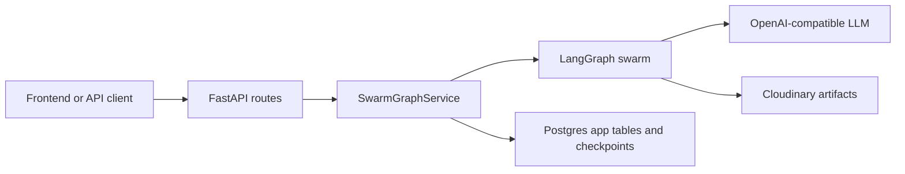

# Backend tour

## The simple mental model

The backend has six layers:

- FastAPI handles HTTP, validation, authentication, and response types.
- `SwarmGraphService` coordinates graph execution and durable session writes.
- LangGraph controls the multi-step swarm.
- SQLAlchemy app tables provide stable session, revision, artifact, and user records.
- the LangGraph Postgres saver stores resumable graph checkpoints.
- Cloudinary stores the actual Mermaid and Markdown file bodies.

## Startup path

`app/main.py` is the composition root. During FastAPI lifespan startup it:

1. verifies required app tables exist with `validate_required_app_tables(engine)`;
2. configures the Cloudinary-backed `artifact_store`;
3. opens and initializes `AsyncPostgresSaver`;
4. compiles the supervisor graph once with that checkpointer;
5. creates one `SwarmGraphService` and stores it on `app.state`.

The graph is therefore compiled once per application process, not once per request.

Startup fails deliberately if the database is not migrated, the database is not Postgres-capable for checkpoints, or Cloudinary credentials are missing. This prevents a request from starting in a half-configured system.

## Folder map

| Path | Responsibility |
|---|---|
| `app/main.py` | App creation, middleware, lifespan, runtime dependency construction |
| `app/api/v1/router.py` | The authoritative list of registered v1 route modules |
| `app/api/v1/endpoints/` | Thin auth and swarm HTTP handlers |
| `app/api/deps.py` | Database, authenticated-user, and graph-service dependencies |
| `app/services/swarm_graph_service.py` | Run/resume/revise orchestration, streaming, ownership checks, app-table persistence |
| `app/agent/graphs/` | Graph topology only |
| `app/agent/subagents/` | Node logic, prompts, structured LLM calls, reducers |
| `app/agent/state/schema.py` | Parent, subgraph, and worker state types |
| `app/agent/streaming.py` | Converts internal LangGraph chunks into the public progress event contract |
| `app/agent/storage/file_store.py` | Cloudinary upload/read abstraction |
| `app/core/llm.py` | Shared OpenAI-compatible chat model construction |
| `app/core/config.py` | Environment-backed settings and validation |
| `app/db/` | SQLAlchemy engine, migrations checks, and LangGraph checkpointer setup |
| `app/models/` | SQLAlchemy models for users and swarm data |
| `app/schemas/` | Pydantic request and response contracts |
| `alembic/versions/` | App-table schema history |
| `tests/` | Executable behavior and regression coverage |

## Two kinds of asynchronous work

The graph APIs are asynchronous because LangGraph and streaming are asynchronous. SQLAlchemy in this repository is synchronous. The service and routes use `run_in_threadpool(...)` for blocking database work so synchronous queries do not block FastAPI's event loop.

This is why database calls sometimes appear one layer away from the code that awaits them.

## Where to start for common changes

| Goal | Read first |
|---|---|
| add/change an endpoint | `app/api/v1/endpoints/`, `app/schemas/`, `app/api/v1/router.py` |
| change swarm order | `app/agent/graphs/supervisor_graph.py`, `app/agent/subagents/supervisor_router.py` |
| change a role or prompt | the matching module under `app/agent/subagents/` |
| add a state field | `app/agent/state/schema.py`, `_empty_swarm_state`, persistence code, schemas, tests |
| change resume/checkpoint behavior | `app/agent/run.py`, `app/db/checkpointer.py`, service methods |
| change durable session data | `app/models/swarm.py`, service persistence helpers, Alembic, schemas |
| debug auth | router, middleware, `app/api/deps.py`, `app/core/security.py`, auth endpoints |

Next: [Request lifecycle](02-request-lifecycle.md).
