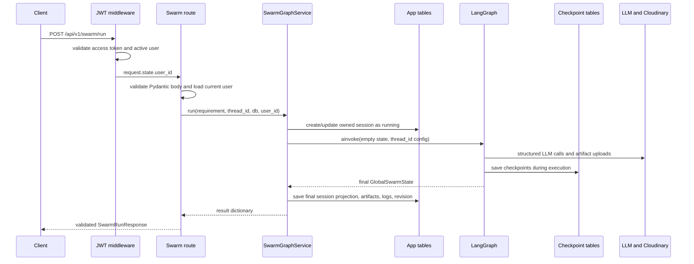

# Request lifecycle

This chapter follows a normal architecture run through the actual layers.

## The complete path



## 1. Authentication runs before the route

`JWTAuthMiddleware` protects `/api/v1/*` except the public auth prefix and documentation/health paths. It accepts an access token from the bearer header first, then the `accessToken` cookie. It verifies the JWT, checks that the database user is active, and stores the user id on `request.state`.

The swarm router also declares `Depends(get_current_user)`. The endpoint receives a real `User` object and passes `current_user.id` into the service. This second dependency is important for ownership, not only authentication.

## 2. FastAPI validates the contract

`app/schemas/swarm.py` defines bodies such as `SwarmRunRequest` and responses such as `SwarmRunResponse`. The handler in `app/api/v1/endpoints/swarm.py` stays thin: it passes validated values to the service and translates domain errors into HTTP status codes.

## 3. The service creates the durable session boundary

Before graph invocation, `_mark_session_running` creates or updates the `sessions` row. New rows receive the authenticated `user_id`. If the same `thread_id` already belongs to another user, the service hides it behind `UnknownSwarmSessionError`, which the API exposes as `404`.

This write happens before the LLM calls. Therefore a failed provider call can still leave a useful session row with `status = failed`.

## 4. The service builds graph input and configuration

`_empty_swarm_state(...)` creates every `GlobalSwarmState` field explicitly. `swarm_config(thread_id)` produces:

```python
{"configurable": {"thread_id": thread_id}}
```

The state is the data the graph works on. The configuration tells the checkpointer which saved execution history belongs to this run.

## 5. LangGraph runs the swarm

The compiled parent graph enters the supervisor, routes through architecture generation, document generation, and reviewers, and saves checkpoints through the attached Postgres saver. Agent modules call the shared LLM from `app/core/llm.py`; diagram/doc workers upload file bodies through `artifact_store`.

## 6. Final state is projected into app tables

When the graph returns, `_mark_session_done`:

- marks the session `done`;
- copies important graph fields into `sessions`;
- replaces the current `debate_logs` rows;
- replaces the current `session_artifacts` rows with URL metadata;
- creates or completes a `swarm_revisions` row containing the result state.

These writes make session APIs stable without forcing frontend clients to understand LangGraph's checkpoint schema.

## 7. Pydantic validates the outgoing response

The endpoint runs the result through `SwarmRunResponse`. A mismatch between graph output and the API contract fails here instead of silently returning an inconsistent payload.

## Synchronous, streaming, resume, and revise

| Operation | Graph input | Client receives |
|---|---|---|
| run | a brand-new empty state | final state response |
| run stream | a brand-new empty state | SSE progress, then a small `done` event |
| resume | `None`, so LangGraph resumes the `thread_id` checkpoint | final state response |
| resume stream | `None` | SSE progress, then `done` |
| revise | app-table snapshot plus a new revision instruction | final revised state |
| revise stream | the same revision input | SSE progress, then `done` |

Next: [How the swarm works](03-how-the-swarm-works.md).
