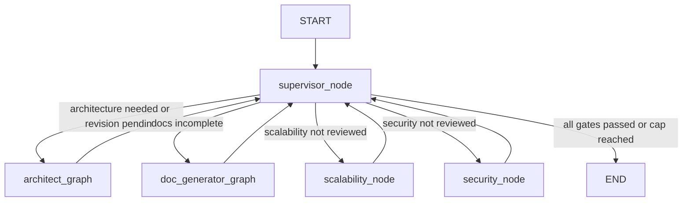
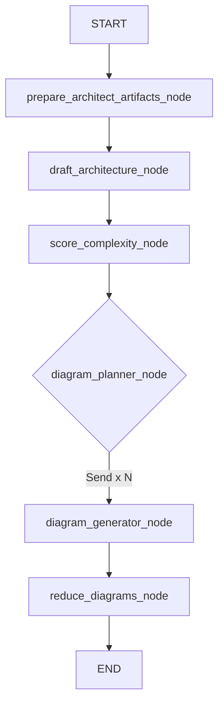
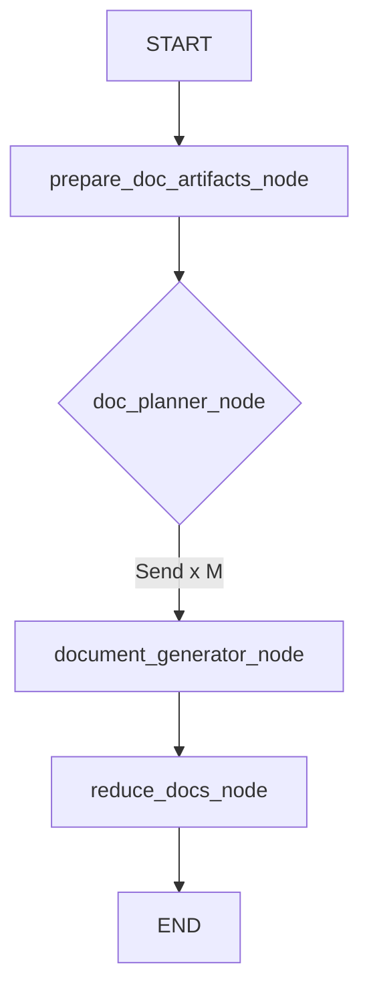

# How the swarm works

## The simple mental model

The swarm is a state machine, not a group chat between autonomous agents.

- Nodes read shared state and return partial updates.
- A deterministic supervisor decides which phase runs next.
- Two compiled subgraphs handle architecture/diagrams and documentation.
- Reviewer nodes can approve the design or send it back through architecture generation.
- LangGraph merges node updates and checkpoints the parent graph by `thread_id`.

## Parent graph

`app/agent/graphs/supervisor_graph.py` mounts five nodes:

The subgraphs are opaque nodes from the parent's perspective: each runs from its own `START` to `END`, then returns its updated state to the parent.

## Supervisor routing order

`app/agent/subagents/supervisor_router.py` contains ordinary Python routing. It does not call the LLM. The first matching rule wins:

1. a pending user revision goes to `architect_graph`;
2. an empty `component_list` goes to `architect_graph`;
3. incomplete docs go to `doc_generator_graph`;
4. rejected scalability feedback goes back to `architect_graph`;
5. missing scalability feedback goes to `scalability_node`;
6. rejected security feedback goes back to `architect_graph`;
7. missing security feedback goes to `security_node`;
8. otherwise the graph ends.

`supervisor_node` increments `iteration_count`. With `MAX_ITERATIONS = 5`, passes one through five may route normally; pass six forces `END`. This is a circuit breaker, so a run can end because the cap was reached even if every desired gate did not complete.

## Architect subgraph

### What each step does

1. Artifact reset removes diagrams/docs from a previous architecture pass and marks docs incomplete.
2. The lead architect uses structured LLM output to produce the architecture, components, and overview Mermaid.
3. The complexity analyzer produces a score plus `diagram_plan` and `doc_plan`.
4. The planner creates one LangGraph `Send` per planned diagram.
5. Workers run with isolated `DiagramWorkerState`, generate/lint Mermaid, upload it to Cloudinary, and return one metadata entry.
6. The reducer waits for all workers, removes entries without storage metadata, and overwrites the accumulated list.

On a user revision, the architect prompt receives the previous architecture plus the new instruction. On a reviewer rejection, it receives reviewer feedback. The same topology handles both cases.

## Documentation subgraph

The `doc_plan` already exists from the complexity analyzer. Each worker receives the architecture and generated-diagram metadata, writes one Markdown document, uploads it, and returns one `DocEntry`. The reducer collects the documents and sets `docs_complete = True`.

## Reviewers and debate logs

The scalability and security nodes use the current architecture, diagrams, and documents. Each returns:

- full feedback text;
- a final `APPROVED` or `REJECTED` status;
- a `DebateLogEntry` recording the agent, feedback, status, and iteration.

The supervisor only checks feedback fields and status text. The reviewers do not choose the next node themselves.

## Why some files are not part of the live swarm

`deep_dive.py` and `summarize.py` exist but are not mounted in `supervisor_graph.py`. Likewise, `app/agent/router/supervisor_router.py` is not the live supervisor router. A Python file existing in the repository does not make it a runtime feature; graph registration is the proof.

## LLM boundary

Agents reuse `get_chat_llm()` from `app/core/llm.py`, which reads the `OPENCODE_*` settings and creates an OpenAI-compatible client. Structured results use Pydantic schemas where shape matters. Model output is normalized before entering state.

For exact topology, continue with [`../graphs/`](../graphs/). For the most delicate graph concept, read [State and data flow](04-state-and-data-flow.md).
