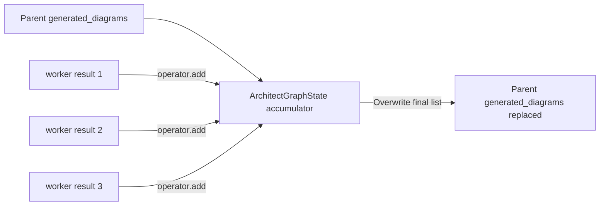

# State and data flow

## State is the swarm's working memory

`GlobalSwarmState` in `app/agent/state/schema.py` is a `TypedDict`. LangGraph passes a state value into a node; the node returns only the fields it wants to update. Nodes should not mutate a global singleton.

The state is grouped conceptually like this:

| Group | Important fields | Main writer |
|---|---|---|
| request identity | `task_requirement`, `thread_id` | service initial state |
| revision context | `revision_number`, `revision_instruction`, `revision_pending` | revision service path and architect |
| architecture | `architecture_draft`, `architecture_json`, `component_list`, `current_architecture_mermaid` | lead architect |
| plans | `complexity_score`, `diagram_plan`, `doc_plan` | complexity analyzer |
| artifacts | `generated_diagrams`, `generated_docs`, `docs_complete` | subgraphs |
| routing | `iteration_count`, `next_agent` | supervisor |
| reviews | `scalability_feedback`, `security_feedback`, `debate_logs` | reviewer nodes |

`_empty_swarm_state` in `SwarmGraphService` must initialize every field. Adding a field only to the `TypedDict` is not enough.

## Partial updates

A node can return a small dictionary such as:

```python
{
    "iteration_count": iteration,
    "next_agent": next_agent,
}
```

LangGraph merges that update into the current state. Fields not returned retain their existing values.

## Parent state versus subgraph state

The most important rule in this codebase is:

- parent artifact lists are replace-only plain lists;
- subgraph worker artifact lists use `operator.add` temporarily for fan-out.



Why: parallel `Send` workers finish independently, so their one-item lists need a reducer inside the subgraph. Once all workers finish, the parent needs one final replacement list. If the parent also used `operator.add`, reviewer-driven reruns would append new artifacts to stale ones and create duplicates.

The same pattern applies to `generated_docs` in `DocGraphState`.

## Reset, fan-out, and fan-in

The artifact lifecycle has three deliberate steps:

1. `prepare_*_artifacts_node` returns `Overwrite([])` to clear the subgraph accumulator.
2. each `Send` worker returns exactly one artifact in a one-item list;
3. `reduce_*_node` returns `Overwrite(collected_items)` at the fan-in boundary.

Do not replace `Overwrite([])` with a normal empty list on reducer-enabled subgraph fields. `operator.add` would merge the empty list and retain the previous accumulator.

## Revision state

`revise` does not simply pass a new prompt into an old checkpoint. `_start_revision` reconstructs the latest successful state from app tables, then overlays:

- incremented `revision_number`;
- new `revision_instruction`;
- `revision_pending = True`;
- `docs_complete = False`;
- reset supervisor/reviewer fields and debate logs.

The supervisor sees `revision_pending` and routes to the architect. The architect returns `revision_pending = False` after applying the change, allowing the normal documentation and review gates to continue.

## State, checkpoints, and app-table projection are different

Do not use these terms interchangeably:

| Concept | Shape | Purpose |
|---|---|---|
| live state | `GlobalSwarmState` | current data being processed by nodes |
| checkpoint snapshot | LangGraph `StateSnapshot` | resumable execution history and next-node information |
| session projection | SQLAlchemy rows | durable, frontend-oriented representation of the latest result |
| revision result | JSON in `swarm_revisions.result_state` | result captured for one numbered revision |

For a detailed treatment of subgraph merging, see [`../flows/state-merge-and-artifacts.md`](../flows/state-merge-and-artifacts.md) and [`../graphs/subgraph-state-transfer.md`](../graphs/subgraph-state-transfer.md).
