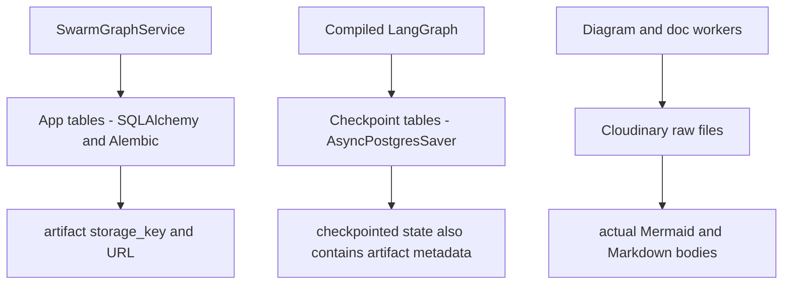

# Database, checkpointer, and artifacts

## The simple mental model

There is one configured Postgres database, but two owners of database tables, plus a separate file store:



Postgres does not store the generated Mermaid/Markdown bodies in the normal API contract. Cloudinary stores those files; state and app tables carry their `storage_key` and `url`.

## Layer 1: LangGraph checkpoint tables

Owner: `AsyncPostgresSaver` from `langgraph-checkpoint-postgres`.

Created/updated by: `await checkpointer.setup()` in `app/db/checkpointer.py`.

Purpose:

- save state as nodes complete;
- associate execution history with `thread_id`;
- let `ainvoke(None, config=swarm_config(thread_id))` resume a saved thread;
- expose a `StateSnapshot` through `aget_state(...)`.

The checkpointer is attached only to the parent supervisor graph at startup. The compiled subgraphs execute inside that parent run.

Alembic must not manage LangGraph's checkpoint tables.

## Layer 2: app tables

Owner: SQLAlchemy models and Alembic migrations.

| Table | Purpose |
|---|---|
| `users` | account identity, hashed password, active flag |
| `sessions` | one latest durable result/status per `thread_id`, owned by `user_id` |
| `session_artifacts` | normalized metadata for the latest diagrams and docs |
| `debate_logs` | latest reviewer feedback entries |
| `swarm_revisions` | numbered instructions, status, and result snapshots |

At startup, `validate_required_app_tables` checks that all required app tables exist. The error tells the operator to run `PYTHONPATH=. alembic upgrade head`.

## Layer 3: Cloudinary

`app/agent/storage/file_store.py` uploads raw text artifacts under paths shaped like:

```text
<folder>/<thread_id>/revisions/<revision>/diagrams/iter<iteration>_<type>.mmd
<folder>/<thread_id>/revisions/<revision>/docs/<filename>.md
```

Workers place only metadata in graph state:

```json
{
  "storage_key": "swarm-artifacts/thread-1/revisions/1/docs/overview.md",
  "url": "https://..."
}
```

This keeps API and checkpoint payloads small and lets clients fetch files from their delivery URLs.

## What happens during a new run

1. Service creates/updates the owned `sessions` row as `running`.
2. Graph nodes run; the Postgres saver writes checkpoints.
3. Artifact workers upload files to Cloudinary and add URL metadata to state.
4. On success, `_mark_session_done` copies the final state projection to `sessions`.
5. It replaces latest `session_artifacts` and `debate_logs` rows.
6. It creates/completes the relevant `swarm_revisions` row with `result_state`.

On a normal run failure, `_mark_session_failed` sets session status and completion time. The graph exception is still raised to the synchronous API caller. A session row marked failed is evidence that the app-table path worked; it does not prove the LLM or graph succeeded.

## Checkpoint view versus session view

| Endpoint | Reads from | Best use |
|---|---|---|
| `GET /swarm/state/{thread_id}` | LangGraph `aget_state`, then `build_checkpoint_payload` | execution/checkpoint status, next nodes, sanitized runtime fields |
| `GET /swarm/sessions/{thread_id}` | `sessions`, `session_artifacts`, `debate_logs`, current revision | durable frontend result view |
| `GET /swarm/sessions/{thread_id}/revisions/...` | `swarm_revisions` | revision history and captured result |

Use the session view for product UI. Use the state view when checkpoint/runtime information matters.

## Why both checkpoint and app tables exist

The checkpointer solves an execution-engine problem: resume a graph correctly. App tables solve a product/API problem: query stable, owned records efficiently without coupling every client to LangGraph internals.

Removing either layer changes a different contract:

- without checkpoints, resume and execution history stop working;
- without app tables, ownership, lists, revision history, and stable durable reads become difficult.

## Thread identity and ownership

The same string `thread_id` connects checkpoint configuration, the `sessions` primary key, artifact paths, debate logs, and revisions. Access control is enforced against `sessions.user_id` before checkpoint state or result data is returned. Checkpoint rows themselves are not the authorization source.

Detailed references: [`../persistence/checkpointer-postgres-alembic.md`](../persistence/checkpointer-postgres-alembic.md) and [`../persistence/session-data-flow.md`](../persistence/session-data-flow.md).
