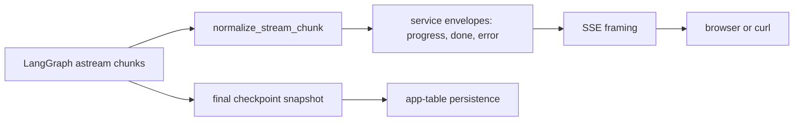

# Streaming

## The simple mental model

Streaming does not run a different swarm. It runs the same graph and changes how progress reaches the client.



## Service-level stream

`SwarmGraphService._stream_graph` calls:

```python
self._graph.astream(
    graph_input,
    config=config,
    stream_mode=["tasks", "updates"],
    subgraphs=True,
    version="v2",
)
```

- `tasks` describes node/task starts and completions.
- `updates` describes state updates emitted by nodes.
- `subgraphs=True` includes nested architect/doc nodes instead of only parent nodes.

## Normalization and safety

Internal LangGraph chunks are not an API contract. `app/agent/streaming.py` maps them to a stable event containing:

```json
{
  "thread_id": "thread-123",
  "type": "task_started",
  "node": "draft_architecture_node",
  "phase": "architecture",
  "message": "Drafting architecture",
  "iteration_count": null,
  "payload": {}
}
```

The normalizer emits `task_started`, `task_completed`, or `state_update`. It assigns a friendly phase/message and whitelists small node-specific fields such as counts, diagram type, document title, or review status.

It intentionally does not stream full prompts, architecture JSON, Mermaid/Markdown bodies, artifact URLs/storage keys, or full reviewer feedback. That limits payload size and avoids exposing internal model context.

## Service envelopes

The service wraps normalized data as:

- `{"event": "progress", "data": ...}` for progress;
- `{"event": "done", "data": {"thread_id": ..., "status": "done"}}` after persistence succeeds;
- `{"event": "error", "data": {"thread_id": ..., "status": "failed", "message": ...}}` for runtime failures.

After graph iteration ends, the service calls `aget_state(config)`, converts the snapshot values to the final result, and persists the session before yielding `done`. Therefore `done` means the final app-table write completed, not merely that the last graph chunk arrived.

## HTTP SSE framing

`app/api/v1/endpoints/swarm.py` converts envelopes to Server-Sent Events:

```text
event: progress
data: {"thread_id":"thread-123",...}

event: done
data: {"thread_id":"thread-123","status":"done"}

```

The response uses `text/event-stream`, `Cache-Control: no-cache`, and `X-Accel-Buffering: no`.

The stream does not send the complete final `SwarmRunResponse`. After `done`, fetch `GET /api/v1/swarm/sessions/{thread_id}` for the durable product result or `/state/{thread_id}` for checkpoint-shaped state.

## Failure and disconnect behavior

- A graph exception is logged, the session/revision is marked failed, and an SSE `error` event is yielded.
- `asyncio.CancelledError` usually means the client disconnected or the request was cancelled. Persistence marks the active session/revision failed, then cancellation is re-raised rather than converted to a normal SSE event.
- Since SSE is a long-lived HTTP response, proxies must not buffer it. The backend header helps, but deployment proxy settings still matter.

## Client sketch

Browser `EventSource` only supports GET, while these endpoints are POST. Use `fetch` and read the response body stream, or an SSE client that supports POST. Always send auth cookies/headers and parse event boundaries separated by a blank line.

For current payload examples and test cases, see [`../current/streaming.md`](../current/streaming.md).
