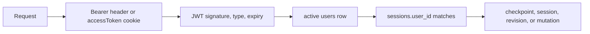

# Authentication and ownership

## The simple mental model

Authentication answers “who is making this request?” Ownership answers “may that user access this thread?” They are separate checks.

## Public and protected routes

`app/api/v1/router.py` registers both auth and swarm routers. The swarm router has `Depends(get_current_user)` at router level.

`JWTAuthMiddleware` protects `/api/v1/*`, with public exceptions for the `/api/v1/auth` prefix, health, and API documentation. Although the auth prefix is public at middleware level, `/auth/me` declares `Depends(get_current_user)` and is therefore authenticated at the endpoint layer.

## Token creation

On signup, login/signin, or refresh, `app/core/security.py` creates:

- an access JWT signed with `JWT_SECRET_KEY` and `token_type = access`;
- a refresh JWT signed with `JWT_REFRESH_SECRET_KEY` and `token_type = refresh`.

Both contain the database user id in `sub` and an expiry in `exp`.

Passwords are stored as bcrypt hashes through Passlib. Plain passwords are never stored.

## Token transport

Successful auth responses currently do both:

- set HttpOnly `accessToken` and `refreshToken` cookies;
- return the access and refresh tokens in JSON for bearer-client compatibility.

For protected requests, token precedence is:

1. `Authorization: Bearer <access-token>`;
2. `accessToken` cookie.

The access cookie uses path `/`. The refresh cookie uses the narrow `/api/v1/auth/refresh` path, so browsers do not send it to swarm routes.

In local HTTP development, `COOKIE_SECURE` must be `false`. Production validation requires it to be `true`. Credentialed CORS requires exact origins in `CORS_ALLOWED_ORIGINS`, not `*`.

## Middleware and dependency roles

The middleware:

1. decides whether a path requires auth;
2. extracts and decodes the access token;
3. queries an active user;
4. stores `user.id` on `request.state.user_id`.

`get_current_user` in `app/api/deps.py`:

1. reuses `request.state.user_id` when middleware already authenticated;
2. otherwise can decode a token itself (needed by `/auth/me` because auth paths bypass middleware);
3. queries and returns the active `User` ORM object.

The repeated database lookup at dependency level gives handlers a current user object and keeps endpoint-level protection usable independently of middleware path rules.

## Session ownership

Each new swarm session receives `sessions.user_id`. The API passes `current_user.id` into service operations. The service checks ownership before:

- reusing a `thread_id` for run;
- resume and streaming resume;
- revise and streaming revise;
- checkpoint reads;
- session detail;
- revision list/detail.

`GET /swarm/sessions` filters directly by the current user and returns newest-first summaries with `limit`/`offset` pagination.

For a missing session and another user's session, the public result is the same `404`. This prevents a caller from discovering whether another user owns a particular `thread_id`.

Legacy rows with `user_id = NULL` are not visible to authenticated users because they do not match any owner.

## Refresh and logout limitations

Refresh accepts an explicit body token first, otherwise the `refreshToken` cookie. It rejects access tokens because the expected token type is `refresh`.

Logout only clears client cookies. There is no server-side revocation table or token blacklist, so a copied bearer token remains usable until it expires. This is a current limitation, not a hidden feature.

For request examples and exact cookie attributes, see [`../current/authentication.md`](../current/authentication.md).
