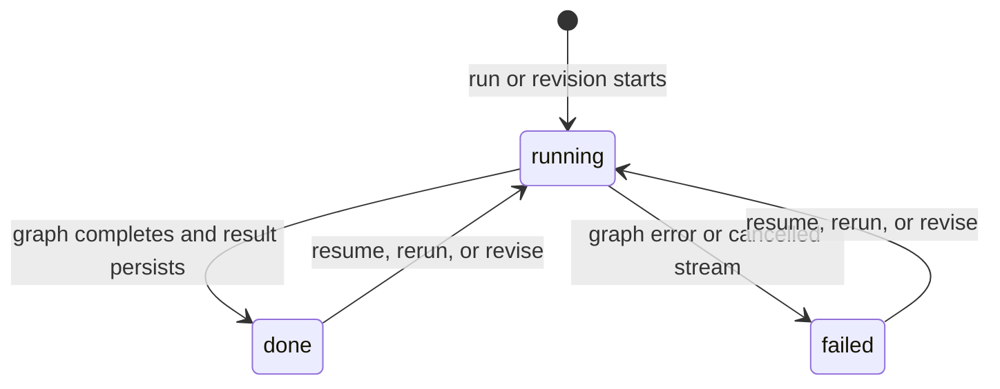

# API and session lifecycle

All `/api/v1/swarm/*` endpoints require an authenticated user. The base prefix below is `/api/v1`.

## Auth endpoints

| Method | Path | Purpose |
|---|---|---|
| POST | `/auth/signup` | create a user and issue cookies/tokens |
| POST | `/auth/login` | authenticate and issue cookies/tokens |
| POST | `/auth/signin` | compatibility alias of login |
| POST | `/auth/refresh` | exchange a refresh token for a new pair |
| POST | `/auth/logout` | clear auth cookies |
| GET | `/auth/me` | return the authenticated active user |

## Execution endpoints

| Method | Path | Purpose |
|---|---|---|
| POST | `/swarm/run` | start a new thread or rerun an owned thread from a fresh initial state; return final state |
| POST | `/swarm/run/stream` | same graph input, return sanitized SSE progress |
| POST | `/swarm/resume` | continue the checkpoint saved for an owned thread using `graph.ainvoke(None, ...)` |
| POST | `/swarm/resume/stream` | resume with SSE progress |
| POST | `/swarm/revise` | create a numbered follow-up revision from the latest durable session state |
| POST | `/swarm/revise/stream` | revise with SSE progress |

### Run versus resume versus revise

- **Run** initializes a complete empty state from `task_requirement`. Reusing an owned `thread_id` updates the session row but still supplies a fresh input state.
- **Resume** supplies no graph input. It asks LangGraph to continue the checkpoint associated with the same `thread_id`.
- **Revise** builds input from the latest successful app-table result, adds a new instruction/revision number, and intentionally restarts supervisor/review progress.

Use revise for “change the existing design.” Use resume for “continue an interrupted checkpoint.”

## Read endpoints

| Method | Path | Source and purpose |
|---|---|---|
| GET | `/swarm/sessions?limit=&offset=` | owned session summaries from `sessions` |
| GET | `/swarm/sessions/{thread_id}` | latest durable session projection, artifact URLs, and debate logs |
| GET | `/swarm/state/{thread_id}` | shaped LangGraph checkpoint snapshot |
| GET | `/swarm/sessions/{thread_id}/revisions` | revision summaries and current revision |
| GET | `/swarm/sessions/{thread_id}/revisions/{number}` | one captured revision result |
| GET | `/swarm/graphs` | available graph ids for introspection |
| GET | `/swarm/graphs/{graph_id}/mermaid?xray=` | rendered Mermaid topology; xray expands nested supervisor subgraphs |

## Session status lifecycle

The current session represents the latest promoted result. `session_artifacts` and `debate_logs` are replaced on successful completion. Revision rows preserve numbered result snapshots.

## Revision lifecycle

1. Lock the session row with `SELECT ... FOR UPDATE`.
2. Verify ownership, that a successful baseline exists, and that the session is not already running.
3. Ensure a baseline revision row exists for older session data.
4. choose `max(revision_number) + 1`;
5. insert the new revision as `running` and mark the session running;
6. run the swarm with revision context;
7. on success, promote the result and mark the revision `done`;
8. on failure, mark that revision and the session `failed`.

Concurrent revise attempts return `409` when the session is already running. Missing and non-owned threads return `404`.

## Choosing the right read after execution

- Product/dashboard UI: use session list and session detail.
- Debugging graph execution: use checkpoint state.
- Version/history UI: use revision endpoints.
- Live progress UI: consume SSE, then refresh session detail after `done`.

The detailed frontend-facing request/response contract remains in [`../../app/api/v1/endpoints/README.md`](../../app/api/v1/endpoints/README.md).
